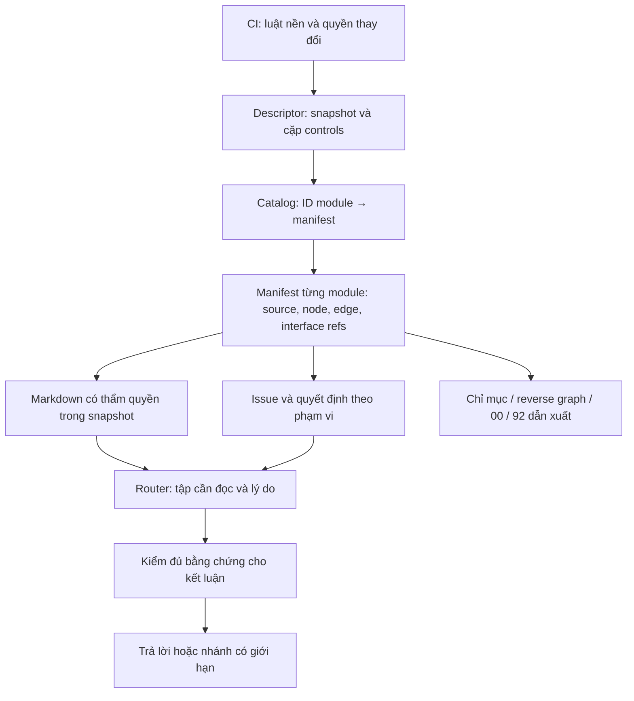

# Kiến trúc đích đề xuất

Trạng thái: **PROPOSAL, chưa kích hoạt**. Giải quyết AR-01…15 và R-01…10; không yêu cầu thay ontology lore.

## 1. Lựa chọn cốt lõi

Chọn một **gói nguồn có snapshot nhất quán và metadata theo module**. Graph là cách tính quan hệ đọc/ảnh hưởng từ metadata; không cần graph database, dịch vụ, agent thường trực hoặc một schema mô phỏng toàn thế giới.

Descriptor không tạo canon: nó ghi lựa chọn control/source đã có căn cứ chấp nhận. Catalog cũng không được tự thăng một file thành authority chỉ bằng đăng ký.

## 2. Ai sở hữu thông tin nào

| Thông tin | Nơi biên tập duy nhất | Đầu ra dẫn xuất | Failure / fallback |
|---|---|---|---|
| Luật hành vi, quyền canon | CI; chi tiết nạp ở Router | Bản release controls | Control không chứng minh được → block thao tác phụ thuộc |
| Bộ active controls + source snapshot | Descriptor có activation/decision reference | Receipt nạp | Hash/compatibility sai → không trộn phiên bản |
| ID module → vị trí manifest | Catalog nhỏ | Global map00 | Mất cache dùng descriptor+manifest cùng snapshot; mất authority root thì block canon |
| Read owner, editable input, node, typed edge | Manifest module | Local index/reverse index | Index stale → full affected file nếu authority còn chứng minh được |
| Lore | Source được chấp nhận, phạm vi có decision/evidence | Có thể sinh current canon từ recipe đã duyệt | Generated canon vẫn có authority đã chỉ định; generated nav không thay canon |
| Interface đa miền | Một metadata owner theo contract; các claim vẫn ở source owners | Global interface index | Thiếu controlling facet → UNKNOWN/BLOCK, không chọn owner theo majority |
| Open-state | Record có ID trong module/nhóm liên quan; liên kết evidence91 |92 summary | UNKNOWN cục bộ vẫn giữ; issue record không resolve chính nó |
| Quyết định/supersession | Record lịch sử có scope và căn cứ |91 summary nếu sau này cần | Không có evidence thì UNVERIFIED; không fabricate approval |
| Archive provenance | File immutable + vai trò admission | Manifest source hashes | File có mặt không tự được import |
| Summary | Biên tập ở owner được khai báo, kèm refs/reviewed revision | Bản đọc gọn | Owner đổi → REVIEW_REQUIRED; hash không chứng minh paraphrase đúng |

Một node source là **đơn vị đọc**, không bắt buộc một claim hoặc một lore entity. Module là **ranh giới sở hữu tài liệu**, domain là **nhãn discovery**. Interface record là **bản đồ phần nào của boundary do nguồn nào quyết định**, không phải nơi phát minh relation.

## 3. Số nguồn quản lý tối thiểu

Đề xuất ba loại artifact cấu trúc, không nhất thiết đúng ba file toàn hệ thống:

1. `release.json`: schema/controls/snapshot/activation, catalog hash, bundle artifacts. Một lần active switch cần cập nhật nó sau validation.
2. `catalog.json`: module ID và đường dẫn manifest; discovery labels chỉ nằm đây hoặc được sinh, không sao chép ở CI/Router.
3. Manifest cục bộ mỗi module: nodes/edges/interface metadata/source bindings/issue refs. Module nhỏ có thể dùng một record trỏ cả file, chưa cần chia node.

Issue và decision giữ payload Markdown, metadata có ID nhỏ trong chính record hoặc cùng manifest tùy pilot. Không thêm riêng authority registry, reverse registry, coverage registry, orphan registry hoặc toàn bộ lore graph. Reverse graph/cross-reference map chỉ là cache tái tạo, có thể global vì **không ai biên tập nó làm nguồn chân lý**.

JSON được đề xuất cho metadata vì repository đã có JSON và PowerShell/Python đọc được sẵn; Markdown tiếp tục là nội dung người dùng sửa. Đây là lựa chọn cần chốt, không phải thay storage hiện hành trong audit. Có thể chọn YAML sau nếu chấp nhận parser và quy tắc scalar/duplicate-key rõ; không cài dependency trong pass này.

## 4. Không đánh đồng read authority với editing owner

Hiện `10`–`80` là generated current canon, archive là provenance bất biến, builder chứa literal đã curate. Vì vậy “edit controlling source” chưa đủ cụ thể.

Manifest cần ba binding:

- `read_source`: nơi phải đọc để lập luận tại release này;
- `edit_input`: đầu vào biên tập cho thay đổi được phép;
- `derivation`: recipe, source inputs, decision refs và output mapping.

Giai đoạn shadow chỉ mô tả thực trạng này. Giai đoạn sau tách literal canon đã duyệt ra Markdown biên tập, giữ archive nguyên byte và tách quyết định biên tập khỏi thao tác build. Chỉ sau kiểm tương đương và quyết định chuyển editing authority mới được sửa input mới. Không bấm “copy current → nguồn mới” rồi tuyên bố đã giải quyết provenance.

## 5. Scope, node và giao diện

Một scope phải đủ cụ thể để có thể kiểm overlap có chủ đích: MC4 identity khác Academy doctrine; ML relic internal khác quyền/status người được chuyển; giao diện AF–TE có mặt event, status và covert operation.

Đối với AF–TE, metadata có thể lưu participants theo **module nguồn** `world`, `undie`, `ml`, trong khi các actor lore AF/TE/ML chỉ nằm trong source. Không nhầm số participant tài liệu với số quốc gia. `controlling_facets` trỏ tới đoạn đã được duyệt ở70/30/10; facet chưa có owner rõ giữ trạng thái chưa chứng minh và chặn phần phụ thuộc. Không thêm một “TE module” chỉ để đủ ví dụ.

Node phải mang hoặc nạp:

- định nghĩa và phạm vi áp dụng;
- guardrail/exception/negation liên quan;
- trạng thái unresolved;
- source owner/supersession;
- dependency bắc cầu đủ cho task.

Không bắt split theo heading. Trước khi cắt file, map byte ranges trong shadow phải bao phủ toàn bộ nội dung (kể cả preamble), mỗi đoạn có owner hoặc shared context rõ, không chồng lấn vô tình. Selector dựa trên hash+marker/section path, không nhận diện bằng line number. Nếu chưa có marker, dùng locator cũ khóa cả source revision và bắt unique match; thay source là invalidation, không đoán vị trí mới.

## 6. Read closure và impact closure khác nhau

Read closure lấy seed từ tác vụ, thêm mandatory context của từng module mới, edge yêu cầu nạp có điều kiện, interface facets, issues và controls. Lặp đến fixed point, mỗi node đọc một lần. `CITES_HISTORY` không thành nạp history tự động; một issue open không mặc định kéo cả91.

Impact closure lấy node thay đổi, duyệt **consumer bắc cầu**, gồm summary, recipe, issue evidence, control hooks và tests. Không chỉ “direct reverse dependencies” như một số bước proposal02. Edge có kiểu giúp tránh dùng build order làm source hierarchy.

Hai closure chỉ hoàn chỉnh **theo metadata đã khai báo và review tại revision đó**. Nguồn mới, boundary lạ, stale dependency review hoặc uncovered span buộc mở rộng đọc. Không có thuật toán nào trong proposal này tự chứng minh tất cả dependency ngữ nghĩa của prose.

## 7. Giao dịch cập nhật và concurrency

Quy trình đề xuất cho thay đổi đã được phép:

1. Pin base Git commit/bundle snapshot, source/metadata/controls hashes và scope approval. Worktree dirty được phân loại trước.
2. Tính affected closure, ghi những consumer chưa được review; block phần thay đổi cần authority chưa rõ.
3. Biên tập đầu vào đã được chỉ định trong checkout riêng; giữ archive cũ bất biến.
4. Build bằng **bytes snapshot riêng**, không đọc file live rồi hash lại live sau đó.
5. Structural validation → semantic decision comparison → regeneration → final full integrity/closure validation. Kiểm sau generation để bắt view lỗi.
6. Kiểm base revision chưa đổi. Nếu đã đổi, không last-writer-wins: nạp lại affected closure, resolve merge theo scope và chạy lại validation cần thiết.
7. Chỉ công bố một commit/bundle đủ toàn bộ artifacts đã validate. Đối với reader từ Git: đọc từng file tại **cùng commit SHA**. Đối với local/export: tạo generation directory bất biến, đổi active pointer cuối cùng và reader pin pointer một lần.
8. Handoff ghi accepted-local / published / installed riêng; cập nhật ChatGPT Project cần kiểm bundle thực sự tải đủ, không suy từ commit/push.

Không cần transaction database. Git hỗ trợ revision và revert; một working tree vẫn có thể partial. Nếu môi trường upload không cung cấp atomic replace, giữ generation cũ active đến khi kiểm đầy đủ generation mới; nếu không chứng minh được, báo `SOURCE_LOAD_BLOCKED` cho tác vụ canon phụ thuộc thay vì dùng tập trộn.

Đây là thiết kế chưa thực thi writer/publisher. Probe hiện tại chỉ xác nhận failure của builder cũ.

## 8. Split, merge, retire, rollback

- Split theo ownership/change boundary, không theo số dòng đơn lẻ. Node giữ ID nếu nghĩa/phạm vi giữ nguyên; owner/path thay metadata. Split một node thành nhiều successor tạo tombstone và mapping theo scope; consumer phải được review.
- Merge không đồng nghĩa nhập ontology. Chỉ đổi container khi hợp đồng ownership/lifecycle phù hợp; ID đã công bố không tái dùng.
- Retirement có record giữ source/evidence; còn required consumer thì không publish removal. `ORPHANED` là tình trạng edge, không là quyền tái gắn lore.
- Rollback đưa cả descriptor, controls, metadata, inputs/outputs về snapshot tương thích được duyệt. Dùng revert hoặc generation trước; không force rewrite. Giữ ID/decision mới trong lịch sử, không tái cấp.
- Rebuild derived artifacts khi merge; không chọn bừa một bên của conflict generated file. Chỉ công bố sau so sánh output với decisions còn hiệu lực.

## 9. Mở rộng 10 lần

Mốc hiện tại là8 current domain files, không phải một số node/module logic đã được canonize. Kịch bản80 module là scale envelope đề xuất. Prototype tổng hợp dùng100 node/module để thử800→8,000 node; đây không phải số node đo từ lore.

`closure_probe.json` cho thấy truy vấn local giữ10 node trong cả hai graph thưa; reverse impact100 node. Ở fanout lớn impact8,001 node; ở graph80 module nối dày closure80 và6,320 edge. Các số này kiểm traversal và không cắt dependency; không dự báo thời gian LLM.

Chi phí full structural validation O(V+E+B), với B là tổng byte phải hash/parse; discovery catalog O(M), read closure sau index O(Vc+Ec). Không đưa graph/node list toàn dự án vào prompt. Có thể cache projection theo snapshot hash; cache không là nguồn authority. Bước đầu ưu tiên full structural validation vì kích thước metadata chưa đòi incremental build phức tạp.

Thêm module chỉ thêm manifest/source/edges, một pointer catalog và release được validate; không sửa CI hoặc thuật toán Router khi primitive không đổi. Derived views tăng theo nội dung thực, không tạo thêm loại global registry cho mỗi loại lore.

**Không thấy nhu cầu major rewrite chỉ vì từ8 lên80 module nếu giữ các hợp đồng này.** Đây là lập luận thiết kế, chưa là bảo đảm thực nghiệm. Nếu mọi module thật sự phụ thuộc mọi module, chi phí tăng là đặc tính bài toán; không được che bằng node routing. Nếu cần primitive mới về temporal/authority mà scope hiện tại không diễn đạt được, phải bump schema có kiểm soát — không hứa CI bất biến vĩnh viễn.

## 10. Khả năng dùng bằng tay

Người dùng tiếp tục sửa Markdown của đầu vào đã chỉ định. Metadata được hiển thị như bảng local index sinh ra; tool chỉ tạo draft refs/IDs, không tự khẳng định edge/truth. Module nhỏ có whole-file node; không bắt điền toàn bộ interface fields khi nguồn chưa định nghĩa.

Giữ current output trong Git ở giai đoạn đầu vì repository đã quản lý chúng và người đọc/export dùng trực tiếp. Sau này chỉ bỏ commit derived navigation nếu đã có cách tái tạo và phân phối được chứng minh; không bỏ generated current canon khỏi Git ngay khi đổi architecture.
