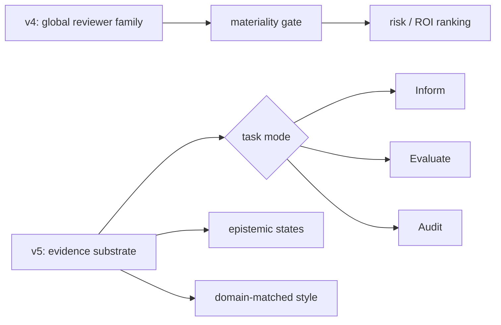

# CI Versioning Audit, Architecture Evolution & Changelog Analysis

## 0. Audit scope and evidence rules

This audit covers the 17 supplied version files, the supplied one-line `Changelog.txt`, the design-rationale document, and the author's supplied deployment context. The version files are the primary evidence for textual and semantic changes. The deployment context is authoritative for design intent: the two era folders are separate character-budget targets, and converted v6.3 is an intentional rollback-safe distillation of v7.3 for returning to Free/Go without falling back to v6.2 semantics. `ci_design_rationale_v3_vi_invariant.md` is explanatory evidence for the current architecture, not another runtime CI version.

Evidence labels used below:

- **Observation**: stated directly in a supplied source.
- **Inference**: a semantic consequence supported by the text but not stated verbatim.
- **Uncertain**: the source does not determine the answer.

Version type is derived from numeric naming unless stronger evidence exists. The user explicitly classified `chatgpt v6.3_7.3 converted.txt` as a **Major** version; that classification overrides the `.3` suffix default.

## 1. Version inventory

| Version | Type | Parent used for audit | Scope | Notes |
| --- | --- | --- | --- | --- |
| v1.0 | Major | None | Full CI | Hardware/real-time empirical-auditor architecture. |
| v2.0 | Major | v1.0 | Full CI | Replaces the v1 protocol with a compact Senior Editor architecture. |
| v2.1 | Patch | v2.0 | Style, density, clarification | Strong textual inheritance from v2.0. No global architectural change. |
| v2.2 | Patch | v2.1 | Compression and epistemic wording | Strong textual inheritance from v2.1. No global architectural change. |
| v3.0 | Major | v2.2 | Full CI | Replaces editor/output scaffolding with an adversarial pragmatic-engineer reviewer. |
| v3.1 | Patch | v3.0 | Reviewer role and clarification threshold | Adds architecture-review, ROI, ranking, and materiality rules. |
| v4.0 | Major | v3.1 | Critique trigger and reviewer role | Numerically major, but source shows a localized architectural adjustment rather than a full rewrite. |
| v5.0 | Major | v4.0 | Full CI | Introduces epistemic states, task modes, domain matching, and evidence-first reasoning. |
| v5.1 | Patch | v5.0 | Truth scope and MECE | Rewrites the first rule and removes several v5.0 surface constraints. |
| v6.0 | Major | v5.1 | Full CI | Introduces “second brain,” exact mode routing, falsifiability, and the first subject/pronoun rule. |
| v6.1 | Patch | v6.0 | Claim handling, context, modes, Vietnamese syntax | Resolves the blanket-premise conflict and strengthens subject-based sentence construction. |
| v6.2 | Patch | v6.1 | Vietnamese terminology | Adds the no-unnecessary-English rule; removes the technical/non-technical sentence. |
| v7.0 | Major | v6.2 | Full CI | Expands the compact v6 rules into explicit operational definitions. |
| v7.1 | Patch | v7.0 | Vietnamese priority, updating, freshness | Strengthens terminology, adds premise-propagation and mandatory freshness search. |
| v7.2 | Patch | v7.1 | Terminology exception, epistemic alternatives, domain style | Relaxes over-broad translation and adds anti-premature-collapse guidance. |
| v7.3 | Patch with architectural effect | v7.2 | Modularization, precedence, response routing | Preserves the main rule set but makes hierarchy and guardrail precedence explicit. |
| v6.3 converted | **Major** | v7.3 | Full converted CI | User-confirmed Major and rollback-safe Free/Go profile. It intentionally distills v7.3 so a plan downgrade does not restore v6.2 semantics. It is not the parent of v7.0. |

### Inventory observations

- **Observation:** 17 version files are present: 8 classified Majors and 9 Patches under the evidence rule above.
- **Observation:** the dataset contains no separate file named plain `v6.3`; the complete filename identifies the converted major.
- **Observation:** `chatgptv7.3.txt` is a separate source and is not interchangeable with the converted v6.3 major.
- **Observation from author context:** `ChatGPT Go-Free Era` and `ChatGPT Plus+ Era` are distinct deployment targets shaped by plan character budgets, not merely chronological folders.
- **Uncertain:** the files contain no timestamps, parent fields, or release metadata for the early patch chains.
- **Inference:** `v2.0 → v2.1 → v2.2`, `v6.0 → v6.1 → v6.2`, and `v7.0 → v7.1 → v7.2 → v7.3` are high-confidence sequential patch chains because each later file preserves and edits the immediately preceding rule set.

## 2. Version lineage

### Evidence-backed working topology

```mermaid
flowchart LR
    V1["v1.0 Major"] --> V2["v2.0 Major"]
    V2 --> V21["v2.1 Patch"] --> V22["v2.2 Patch"]
    V22 --> V3["v3.0 Major"] --> V31["v3.1 Patch"] --> V4["v4.0 Major"]
    V4 --> V5["v5.0 Major"] --> V51["v5.1 Patch"] --> V6["v6.0 Major"]
    V6 --> V61["v6.1 Patch"] --> V62["v6.2 Patch"] --> V7["v7.0 Major"]
    V7 --> V71["v7.1 Patch"] --> V72["v7.2 Patch"] --> V73["v7.3 Patch / architectural effect"]
    V73 -->|"distilled / converted"| C63["v6.3 converted Major"]
```

The last edge is directly grounded by `ChatGPT Go-Free Era/Changelog.txt:1` and the user-confirmed Major classification. Numeric sorting alone would incorrectly place the converted major before v7.0.

## 3. Executive summary

The history has six broad architectural eras rather than 17 redesigns:

1. **v1.0 — specialized empirical protocol.** Real-time hardware verification, a three-part existence test, raw extraction, command triggers, exhaustive output, and a Vietnamese-only output requirement are bundled into a monolith.
2. **v2.x — compact editorial protocol.** The hardware-specific system is replaced with a concise Senior Editor, controlled response length, conclusion-first structure, failure scanning, and expansion options. v2.1 tunes repetition and social reactions; v2.2 compresses the same system and introduces explicit fact/inference/assumption language.
3. **v3.x–v4.0 — adversarial reviewer.** The editor scaffold is replaced by direct critical review. v3.1 adds architecture/ROI/risk ranking. v4.0 narrows challenge behavior to cases that materially affect a decision and changes Reviewer to Advisor + Reviewer.
4. **v5.x — epistemic and task-aware architecture.** The CI stops making critique the default. It introduces observations/inferences/assumptions/conclusions, alternative interpretations, Inform/Evaluate/Audit routing, domain-matched style, and time-sensitive verification. v5.1 adds truth scope and MECE but drops some v5.0 guarantees.
5. **v6.x–v7.2 — compact second-brain rules expanded operationally.** v6.0 introduces exact mode routing, falsifiability, and a Vietnamese pronoun rule but contains a conflict over whether stated premises are accepted. v6.1 resolves that conflict, adds chat isolation, and upgrades the Vietnamese rule from pronoun deletion to subject-based sentence construction. v6.2 adds Vietnamese terminology. v7.0 expands these rules; v7.1 adds update propagation and freshness search; v7.2 corrects the terminology rule and strengthens ambiguity handling and domain-style matching.
6. **v7.3 and converted v6.3 — explicit invariant/guardrail hierarchy.** v7.3 turns the language rules into a primary/supporting invariant hierarchy, treats other rules as relaxable guardrails, and makes correctness outrank style. The converted v6.3 major distills that architecture to five paragraphs, preserving its core but removing several operational safeguards.

### Most important candidate invariants

- **R04 — evidence discipline:** present in specialized form at v1, generalized at v5, explicit from v6 onward. It is semantically unstable at v6.0 but repaired at v6.1.
- **R05 — epistemic-state separation:** first explicit precursor at v2.2; stable architecture from v5 onward.
- **R07 — response mode routing:** first appears at v5 and remains active, but its precedence changes at v7.3 so that a claim alone no longer forces Audit.
- **R02/R03 — Vietnamese subject structure and terminology:** R02 begins at v6.0 and becomes a primary invariant by v7.3; R03 begins at v6.2 and becomes the supporting invariant. These are current-architecture invariants, not invariants across the entire history.

### Most important regression findings

- **Confirmed internal conflict in v6.0:** line 1 requires independent evidence for agreement while line 9 accepts all stated premises unless reality checking is requested. v6.1 removes the blanket-premise rule and distinguishes objective claims from opinions/observations.
- **Regression candidate in v5.1:** v5.0’s explicit time-sensitive verification rule disappears and does not return until v7.1.
- **Regression candidate in v6.1:** the explicit falsifier requirement for every non-trivial conclusion disappears; it returns in v7.0 and is later scoped in v7.3.
- **Regression candidate in v7.3:** “Search before answering” becomes the broader “verify when recency could affect the answer,” weakening the specified mechanism while keeping the freshness guarantee.
- **Intentional conversion trade-offs in v6.3 converted:** freshness, chat isolation, technical/non-technical handling, explicit discriminator/falsifier rules, and correctness-over-style precedence are omitted to fit the Free/Go character budget. These omissions create residual parity risks to test, but are not confirmed regressions by themselves.

## 4. Normalized rule identities

| Rule ID | Normalized concept | First seen | Major versions | Patch activity | Current status at v7.3 / converted v6.3 | Notes |
| --- | --- | --- | --- | --- | --- | --- |
| R01 | Vietnamese output baseline | v1.0 | v1, v2; implicit in later Vietnamese-specific rules | Stable through v2.2; absent as a global rule in v3–v5; reconstructed by R02/R03 from v6 | Modified | A language-only lexical match would miss the gap between “answer in Vietnamese” and structural Vietnamese rules. |
| R02 | Subject-centered Vietnamese syntax | v6.0 | v6, v7, converted v6.3 | v6.1 strengthens deletion into sentence reconstruction; v7.3 declares primary invariant | Active | Primary invariant in both v7.3 and conversion. |
| R03 | Vietnamese terminology / necessary English exception | v6.2 | v7, converted v6.3 | v7.1 strengthens; v7.2 relaxes; v7.3 formalizes; conversion relaxes recognition/precision exception | Modified | Supporting invariant; constraint strength changes materially. |
| R04 | Objective-claim verification / no unsupported agreement | v1.0 precursor; v5.0 general | v1, v5, v6, v7, converted v6.3 | v6.0 conflict; v6.1 claim/opinion split; v7.3 status-preservation wording | Active | Current rule distinguishes objective claims from subjective inputs. |
| R05 | Observation / inference / assumption / conclusion separation | v2.2 precursor; v5.0 full | v5, v6, v7, converted v6.3 | Expanded in v7.2–v7.3; compressed in conversion | Active | Stable semantic lineage despite terminology and language changes. |
| R06 | Preserve plausible alternatives / discriminating conditions | v5.0 | v5, v6, v7, converted v6.3 | v6 adds falsification; v7.2 blocks single-alternative substitution; v7.3 adds discriminator | Modified | Conversion keeps viable alternatives but drops explicit discriminator. |
| R07 | Inform / Evaluate / Audit response modes | v5.0 | v5, v6, v7, converted v6.3 | v6 makes exactly one mode and adds defaults; v7.3 makes one primary mode and says a claim alone does not force Audit | Modified | Major precedence change at v7.3. |
| R08 | Material-ambiguity clarification threshold | v3.0 precursor | v3, v4, v5, v6, v7, converted v6.3 | v3.1 introduces materiality; v6 re-tightens; v7.3 allows smallest reasonable assumption | Active | Current form avoids blocking on immaterial ambiguity. |
| R09 | Update conclusions only on new evidence; propagate premise changes | v7.1 | v7, converted v6.3 | Preserved in v7.2–v7.3; compressed in conversion | Active | New guarantee in the v7 patch line. |
| R10 | Chat/context isolation | v6.1 | v7 | Preserved through v7.3; omitted from conversion | Removed in conversion | v7.3 allows explicitly imported chat/project/memory/source context. |
| R11 | Fresh/time-sensitive verification | v1.0 specialized; v5.0 general | v1, v5, v7 | Removed v2; removed v5.1; restored v7.1; mechanism relaxed v7.3; omitted conversion | Removed in conversion | Not historically invariant. |
| R12 | Technical vs non-technical treatment | v5.0 | v5, v6, v7 | Removed v6.2; restored v7.0; expanded jargon rule v7.3; omitted conversion | Removed in conversion | Motive/emotion guard is stable whenever the rule exists. |
| R13 | Domain-matched depth and style | v5.0 | v5, v6, converted v6.3; v7 patch line | Removed v6.1–v7.1; restored with explicit worldbuilding at v7.2; modularized v7.3 | Active | Conversion retains a compact form. |
| R14 | Critical directness / social-smoothing suppression | v1.0 | v1–v4; partial later | v4 scopes challenge to material effects; v5 replaces default critique with mode routing | Merged | Absorbed into Audit and density rules rather than retained as a global style. |
| R15 | Concision, density, and conditional structure | v2.0 | v2–v7, converted v6.3 | Exact sentence caps disappear v3; density rule becomes “every sentence advances”; v7.3 relaxes formal-analysis surface | Active | Semantics move from length limits to information value. |
| R16 | Task scope and truth scope | v5.1 | v6 | v6.0 broadens stated-premise authority too far; v6.1 replaces it with claim/opinion distinction | Merged | Current behavior is distributed across R04, R07, and R08. |
| R17 | Multi-source / raw-data hardware validation | v1.0 | v1 only | Removed by v2.0 | Removed | No later semantic equivalent to the three-source/SKU/benchmark guarantee. |
| R18 | Trigger and format precedence system | v1.0 | v1 only | Removed by v2.0 | Removed | `@Update`, `@Current`, `@Full`, `@Logic`, `@Crit`, `@Table`, `@Step`, `EXIT_CORE`. |
| R19 | Failure Scan and Expansion Options | v2.0 | v2 only | Preserved through v2.2; removed by v3.0 | Removed | Output module, not a lasting architecture invariant. |
| R20 | No unsupported user-character/motive inference | v3.0 | v3–v7 | Generalized into technical/non-technical split at v5; omitted conversion except indirectly via evidence discipline | Modified | Conversion does not retain the explicit non-technical guard. |
| R21 | Falsifiability of non-trivial conclusions | v6.0 | v6, v7 | Removed v6.1–v6.2; restored v7.0; scoped to consequential/uncertain/decision-relevant in v7.3; omitted conversion | Removed in conversion | Scope change reduces surface burden while keeping high-value cases. |
| R22 | MECE when useful | v5.1 | v6 | Conditionalized v6.0; removed v6.1 | Removed | No later exact equivalent. |

## 5. Per-version changelog

### v1.0

**Type:** Major  
**Compared against:** None

#### Added

- Real-time-only handling for post-cutoff hardware, `[Thiếu dữ liệu]`, three-part physical-launch validation, raw extraction, and side-by-side conflict reporting (line 1).
- A special `what/if` hypothetical-state rule (line 3).
- Empirical Auditor role, clinical objectivity, an 80/20 data-to-interpretation ratio, and explicit missing-data disclosure (line 5).
- Trigger, method, format, and conflict-precedence commands plus `EXIT_CORE` (line 7).
- No end questions/options, exhaustive power-user output, three sources for important claims, two-step inference cap, and Vietnamese-only answers (lines 9–15).

#### Architectural effect

Monolithic, hardware-oriented, command-driven CI. Most later architectures do not preserve this specialization.

### v2.0

**Type:** Major  
**Compared against:** v1.0

#### Added

- Senior Editor role; concise Vietnamese responses; short jargon definitions; sentence caps; conclusion-first structure.
- Explicit Failure Scan and Expansion Options modules.
- Natural/casual peer style, anti-academic wording, and a fixed output anchor.

#### Removed

- Hardware-specific real-time and three-source validation, raw-data-only extraction, trigger DSL, `EXIT_CORE`, exhaustive-output requirement, and the `what/if` thread-state rule.

#### Semantic changes

- The system changes from exhaustive empirical auditing to compact editorial explanation.
- v1’s ban on next-step options is reversed by the mandatory Expansion Options section.

#### Regression candidates

- R17 and R18 guarantees are fully removed. Whether this is a regression or deliberate scope replacement is **not determined from source**.

### v2.1

**Type:** Patch  
**Compared against:** v2.0

#### Added

- Repeated transition-structure cap and no low-information social reaction (lines 11–12).
- Conditional conclusion-first behavior when evidence is sufficient (line 15).
- Structure only when it improves clarity; no headings/lists for very short content (line 17).
- No semantic repetition, denser natural style, terminology-precision exception, and phrase blacklist.

#### Semantic changes

- Jargon avoidance becomes conditional: technical terms are allowed when they improve accuracy.
- Conclusion-first is weakened from absolute to evidence-dependent.
- Structural Markdown is weakened from default to utility-dependent.

#### Architectural effect

No global architectural change.

### v2.2

**Type:** Patch  
**Compared against:** v2.1

#### Added

- Explicit “Fact vs inference vs assumption” focus (line 36).
- Consolidated no-fluff/social-smoothing and short-direct-sentence rules.

#### Removed

- Mandatory disclosure when technical detail is simplified.
- The everyday-example rule, fixed Output Anchor, transition-pattern repetition cap, and explicit no-user-summary-like reaction wording.

#### Semantic changes

- The detailed v2.1 style system is compressed into shorter principles.
- Exact rules become general constraints; some operational nuance is lost.

#### Regression candidates

- Loss of the explicit simplification disclosure is a low-risk guarantee loss.

#### Architectural effect

No global architectural change.

### v3.0

**Type:** Major  
**Compared against:** v2.2

#### Added

- Global adversarial review of assumptions, contradictions, hidden costs, bias, rationalization, overengineering, escapism, and unrealistic expectations.
- Direct criticism without diplomatic/therapist/corporate smoothing.
- Explicit separation of strengths, weaknesses, uncertainty, and trade-offs.
- Pragmatic Engineer style, no user-character classification, and a three-question clarification protocol.

#### Removed

- Senior Editor role, sentence limits, conclusion-first format, Markdown/output anchor, Failure Scan, and Expansion Options.

#### Semantic changes

- Critique changes from an optional failure scan to the global default across topics.
- The architecture prioritizes critical judgment over compact explanation.

### v3.1

**Type:** Patch  
**Compared against:** v3.0

#### Added

- Hybrid Architecture Reviewer + Pragmatic Engineer role; correctness, risk reduction, ROI, impact/likelihood ranking, and now/later/never prioritization.
- Clarification only when missing goals/data could materially alter the conclusion.
- No unsolicited user summary.

#### Removed / weakened

- “Do not protect bad ideas from criticism” is removed; “Be constructive” remains.
- The unconditional three-question clarification protocol is replaced by a materiality threshold.

#### Architectural effect

No global redesign, but the reviewer role and clarification precedence change semantically.

### v4.0

**Type:** Major  
**Compared against:** v3.1

#### Semantic changes

- Challenge behavior is narrowed from “across all topics” to cases that materially affect the user’s decision, conclusion, plan, or recommendation request (line 3).
- “Architecture Reviewer” becomes “Architecture Advisor + Reviewer” (line 14).

#### Preserved

- Directness, anti-smoothing, risk/ROI ranking, overengineering rejection, no personality inference, and material clarification threshold.

#### Architectural effect

Numerically major but semantically localized: critique gains a materiality gate and the role gains advisory behavior.

### v5.0

**Type:** Major  
**Compared against:** v4.0

#### Added

- Correctness/evidence-first answer routing, answer-first expansion, and no unrelated drift.
- Observation/inference/assumption/conclusion separation and conditional alternatives.
- Technical mechanism/design/trade-off/downstream/failure-mode handling; non-technical no-personality/motive/emotion inference.
- Domain-matched final style.
- Inform/Evaluate/Audit modes.
- Natural information-dense prose and time-sensitive verification.

#### Removed / merged

- Global harsh-critique style, vague-qualifier blacklist, Hybrid Advisor role, ROI/risk ranking, and now/later/never output are removed.
- Critique survives as the Audit mode rather than a universal behavior.

#### Architectural effect

Full redesign from role/persona rules to task routing plus epistemic guardrails.

### v5.1

**Type:** Patch  
**Compared against:** v5.0

#### Added

- Task scope and applicable truth scope.
- User-defined model premises are authoritative unless external-reality evaluation is requested.
- MECE when it materially improves analysis/comparison.

#### Removed

- Explicit answer-first behavior, related-expansion boundary, unrelated-topic-drift ban, and time-sensitive verification.

#### Semantic changes

- Evidence is made relative to a truth scope, preventing external reality from silently overriding an explicitly defined model.

#### Regression candidates

- R11 freshness verification disappears until v7.1.

#### Architectural effect

No global architectural change.

### v6.0

**Type:** Major  
**Compared against:** v5.1

#### Added

- “Second brain” objective and no unsupported praise/validation.
- Exactly one mode, explicit default routing, and clarification on unclear/contradictory premises.
- Falsifying conditions for interpretations and every non-trivial conclusion.
- Every-sentence value test and a three-reasoning-line structure threshold.
- First Vietnamese personal-pronoun reduction rule.

#### Semantic changes

- MECE is narrowed to cases where it changes analysis.
- v5.1 truth scope is broadened into “Treat stated premises as given unless asked to check against reality.”

#### Confirmed conflict

- Line 1 says agreement requires independent evidence; line 9 says stated premises are given unless reality checking is requested. An objective user claim can trigger both rules with incompatible actions. v6.1 removes line 9 and resolves the conflict.

### v6.1

**Type:** Patch  
**Compared against:** v6.0

#### Added

- Objective-claim versus opinion/first-person-observation distinction.
- Independent chat sandbox/context isolation.
- Mode selection per current message rather than conversation topic.
- Vietnamese sentences must be built around the discussed subject; deleting pronouns afterward is insufficient.

#### Removed

- Blanket acceptance of stated premises, explicit non-trivial-conclusion falsifier, MECE, domain-style rule, and explicit structure threshold.

#### Fixed / regression protection

- Resolves the v6.0 evidence-versus-premise conflict.

#### Regression candidates

- The R21 non-trivial falsifier guarantee is removed until v7.0.

#### Architectural effect

No global redesign, but evidence precedence and Vietnamese syntax change materially.

### v6.2

**Type:** Patch  
**Compared against:** v6.1

#### Added

- Vietnamese terminology rule: do not switch to English when a natural Vietnamese term exists; retain English only when no real Vietnamese equivalent exists.

#### Removed

- Explicit technical-mechanism/trade-off and non-technical motive/emotion sentence.

#### Architectural effect

No global architectural change. R03 is introduced as a local language patch.

### v7.0

**Type:** Major  
**Compared against:** v6.2

#### Added / expanded

- Full operational definitions for objective versus subjective claims, chat isolation, per-message modes, epistemic states, ambiguity, and falsification.
- Restores technical/non-technical treatment, explicit non-trivial falsifiability, and conditional structure.
- Expands subject-centered Vietnamese syntax and terminology constraints.

#### Semantic changes

- Inform explicitly forbids evaluative framing and recommendation.
- Audit is the default for an existing decision or objective claim.
- R21 returns for non-trivial conclusions.

#### Architectural effect

Expansion of the compact v6.2 architecture into a fully specified major version; no return to v3/v4 global critique.

### v7.1

**Type:** Patch  
**Compared against:** v7.0

#### Added

- Vietnamese subject and terminology rules moved to the top.
- Strong “every word Vietnamese if a Vietnamese word exists” constraint, including headings/lists.
- Update propagation: revise all conclusions dependent on a corrected premise; confidence/repetition is not evidence.
- Time-sensitive facts must be searched before answering.

#### Modified

- Inform retains “no evaluative framing” but drops v7.0’s explicit “no recommendation.”

#### Constraint changes

- R03 is strongly tightened and risks forcing technically awkward translations; v7.2 relaxes this.
- R11 is strengthened from v5.0-style verification to an explicit search requirement.

#### Architectural effect

No global redesign. The patch adds two cross-cutting guards: update propagation and freshness.

### v7.2

**Type:** Patch  
**Compared against:** v7.1

#### Added

- Explicit anti-premature-collapse rule for undetermined causes: keep candidates and test each against cases.
- Domain-matched final style, including ordinary chat and worldbuilding/fiction.

#### Semantic changes

- R03 is relaxed: Vietnamese is required only when the translation is natural and meaning-preserving; established terms may remain English when translation would mislead or look like an amateur mistranslation.

#### Fixed / regression protection

- Protects against v7.1’s over-broad “every word” translation constraint.

#### Lexical defect

- The file ends with an isolated trailing `s`; no semantic meaning is evidenced.

#### Architectural effect

No global architectural change.

### v7.3

**Type:** Patch with architectural effect  
**Compared against:** v7.2

#### Added

- Named modules for evidence, updating, epistemic state, response mode, ambiguity, technical/non-technical handling, freshness, context, depth/style, and priority.
- Explicit primary/supporting invariant hierarchy: subject structure first, terminology second.
- Remaining rules become relaxable guardrails; correctness explicitly overrides style.
- Evidence guardrails operate in every mode without displacing the primary task.
- Inform/Evaluate/Audit becomes one **primary** mode, and a claim alone no longer forces Audit.
- Ambiguity may be handled with the smallest reasonable assumption when it cannot materially change the answer.

#### Constraint changes

- Terminology is stricter than v7.2 about common English usage but retains precision/ambiguity/obscurity/naturalness exceptions.
- Freshness changes from mandatory “Search before answering” to “verify when recency could affect the answer.”
- Epistemic separation and falsifier display become relevance/consequence-sensitive rather than universal surface requirements.
- Inform may add judgment when needed, weakening v7.0/v7.1’s absolute no-evaluation framing.

#### Structural changes

- Long prose is reorganized into independently named rule modules.
- The opening “second brain” framing is removed; the behavior is represented directly by guardrails.

#### Architectural effect

Material architecture evolution without replacing the rule family: precedence is explicit, guardrails are context-softened, and language invariants are protected from those relaxations.

### v6.3 converted

**Type:** **Major**  
**Compared against:** v7.3  
**Provenance:** `Changelog.txt` states “distilled from 7.3”; the user confirms this file is a major version.

#### Preserved / compressed

- Primary subject-structure invariant and supporting Vietnamese-terminology rule.
- Objective-claim evidence status, opinion/observation input status, and update propagation.
- Epistemic-state separation and viable alternatives.
- Inform/Evaluate/Audit with claim-not-forcing-Audit precedence.
- Material ambiguity threshold, smallest assumption, domain style, and anti-padding behavior.

#### Removed

- Explicit freshness rule, context isolation, technical/non-technical handling, jargon guard, discriminating evidence, consequential falsifier, correctness-over-style precedence, and the general guardrail-relaxation rule.

#### Semantic changes

- R03 is relaxed further: English may remain when clearly more recognizable or precise, while common use alone remains insufficient.
- v7.3’s detailed hierarchy is compressed to “Subject structure is primary; terminology supports it.”

#### Intentional deployment trade-offs and residual risks

- Omission of R10, R11, R12, and R21 removes explicit guarantees as part of deliberate semantic distillation for the Free/Go character budget.
- The remaining risk is behavioral parity: a regression is confirmed only if representative output tests show that an omitted guarantee now fails.

#### Architectural effect

Major conversion through semantic distillation: the invariant core remains, while operational guardrails are substantially reduced.

## 6. Major-version architecture evolution

### v1.0 → v2.0

- **Architecture:** command-driven empirical hardware auditor → compact editorial response template.
- **Removed mechanisms:** real-time hardware validation, source-count requirement, raw-only extraction, trigger precedence.
- **Net effect:** far more general and compact, but specialized evidence guarantees disappear.

### v2.0 → v3.0

- **Architecture:** structured editor with failure/expansion modules → global adversarial pragmatic reviewer.
- **Constraint strength:** critique and anti-smoothing become stronger; output formatting and sentence limits disappear.
- **Net effect:** evaluation dominates explanation, increasing critical pressure but reducing task adaptability.

### v3.0 → v4.0

- **Architecture:** the same reviewer family persists.
- **Precedence:** challenge is gated by material effect on a decision/plan/recommendation.
- **Net effect:** a localized softening, not a full redesign despite the major number.

### v4.0 → v5.0

- **Architecture:** persona/critique rules → task router plus epistemic guardrails.
- **Added mechanisms:** Inform/Evaluate/Audit, epistemic states, alternative interpretations, domain matching, freshness.
- **Removed mechanisms:** global harsh-review persona and ROI/risk-ranking template.
- **Net effect:** critique becomes task-dependent; correctness and evidence become the common substrate.

### v5.0 → v6.0

- **Architecture:** flexible mode family → exactly-one-mode “second brain” with explicit defaults and falsifiability.
- **Invariant precursor:** first Vietnamese subject/pronoun behavior appears.
- **Risk:** blanket premise acceptance conflicts with independent-evidence agreement.
- **Net effect:** more compact and operational, but v6.0 introduces a precedence defect repaired by v6.1.

### v6.0 → v7.0

- **Architecture:** compact rule list → expanded operational specification.
- **Patch contribution:** v6.1 supplies claim/opinion distinction, context isolation, per-message routing, and subject reconstruction; v6.2 supplies terminology.
- **Net effect:** v7.0 integrates the two patches and restores dropped technical and falsifier rules. Domain-matched style does not return until v7.2.

### v7.0 → v6.3 converted (through v7.1–v7.3)

- **Architecture path:** v7.1 adds update/freshness and hard terminology; v7.2 repairs terminology and ambiguity; v7.3 introduces explicit invariant/guardrail hierarchy; converted v6.3 distills that hierarchy.
- **Precedence:** language invariants become primary/supporting; other rules become guardrails in v7.3.
- **Compression:** converted v6.3 preserves the core but drops several guardrails.
- **Net effect:** a smaller major suitable for the converted branch, with lower explicit failure-mode coverage.

## 7. Invariant evolution

### Subject-centered Vietnamese syntax

**Rule ID:** R02  
**First appearance:** v6.0  
**Major versions:** v6.0, v7.0, converted v6.3  
**Relevant patches:** v6.1, v6.2, v7.1, v7.2, v7.3  
**Current status:** Preserved and prioritized

#### Evolution

- **v6.0:** drop personal pronouns when clarity remains; documentation-like surface.
- **v6.1:** structural rewrite from the discussed subject; post-hoc deletion is explicitly insufficient.
- **v7.0–v7.2:** expanded and moved to the top.
- **v7.3:** declared the primary invariant; real speaker/listener subject is an exception.
- **converted v6.3:** preserved as the first and primary rule.

#### Semantic assessment

This is a confirmed invariant of the current architecture, not of the entire history. The semantics strengthen from lexical pronoun deletion to grammatical-subject construction.

### Vietnamese terminology

**Rule ID:** R03  
**First appearance:** v6.2  
**Major versions:** v7.0, converted v6.3  
**Relevant patches:** v7.1, v7.2, v7.3  
**Current status:** Modified; supporting invariant

#### Evolution

- **v6.2/v7.0:** use natural Vietnamese; English only with no real/accepted equivalent.
- **v7.1:** strongest form—every word must be Vietnamese if a Vietnamese word exists.
- **v7.2:** relax when translation misleads or produces an unnatural established-term translation.
- **v7.3:** Vietnamese wins when both are viable, but precision, ambiguity, obscurity, and unnaturalness are valid exceptions.
- **converted v6.3:** adds “clearly more recognizable or precise” as an exception; common use alone remains insufficient.

#### Semantic assessment

The core invariant is preserved, but constraint strength oscillates. v7.1 is the strongest; v7.2 weakens it; v7.3 formalizes a balanced rule; conversion weakens it further on recognizability.

### Evidence and epistemic state

**Rule IDs:** R04, R05, R06  
**First appearance:** v1.0 specialized; v2.2/v5.0 generalized  
**Major versions:** v1, v5, v6, v7, converted v6.3  
**Current status:** Preserved with one repaired conflict

#### Evolution

- **v1.0:** hardware-specific verification and `[Thiếu dữ liệu]`.
- **v2.2:** fact/inference/assumption focus.
- **v5.0:** full observation/inference/assumption/conclusion model and conditional alternatives.
- **v6.0:** adds falsification but conflicts with blanket premise acceptance.
- **v6.1:** repairs claim handling and distinguishes subjective inputs.
- **v7.2–v7.3:** prevents collapsing viable explanations and requests discriminating evidence when relevant.
- **converted v6.3:** preserves states and alternatives, drops explicit discrimination/falsifier detail.

#### Semantic assessment

Candidate invariant across the modern architecture. The exact source-validation mechanism is not invariant.

### Response-mode routing

**Rule ID:** R07  
**First appearance:** v5.0  
**Major versions:** v5, v6, v7, converted v6.3  
**Current status:** Modified

#### Evolution

- **v5.0:** descriptive Inform/Evaluate/Audit roles without exact-one/default rules.
- **v6.0:** exactly one mode; objective claim/decision defaults to Audit.
- **v6.1–v7.2:** selection is per current message; claim/decision continues to default to Audit.
- **v7.3:** one primary mode; claim alone explicitly does not force Audit; evidence rules run independently in every mode.
- **converted v6.3:** preserves v7.3 precedence in compressed form.

#### Semantic assessment

v7.3 is a semantic and precedence change, not a lexical rewrite. It prevents the evidence guard from displacing an Inform or Evaluate task.

## 8. Semantic versus lexical summary

### Behavior-affecting changes

- v1 → v2: specialized verification/exhaustiveness is replaced by concise editorial behavior.
- v2.0 → v2.1: conclusion-first and structure become conditional.
- v2.2 → v3: critique becomes the global default; fixed output modules disappear.
- v3.1 → v4: challenge receives a materiality gate.
- v4 → v5: critique becomes mode-specific and epistemic state becomes explicit.
- v5 → v5.1: truth-scope premises become authoritative inside user-defined models; freshness disappears.
- v5.1 → v6: exact mode selection, falsification, and subject-pronoun behavior appear; premise/evidence conflict is introduced.
- v6 → v6.1: objective claim and subjective observation split; context isolation and structural Vietnamese appear; conflict is fixed.
- v6.1 → v6.2: terminology constraint appears; technical/non-technical guard disappears.
- v7.0 → v7.1: update propagation and mandatory freshness search appear; terminology is strongly tightened.
- v7.1 → v7.2: terminology is relaxed; ambiguity handling and domain-style behavior are strengthened.
- v7.2 → v7.3: hierarchy, precedence, primary-mode routing, guardrail softness, and freshness mechanism change.
- v7.3 → converted v6.3: major compression removes explicit guardrails and relaxes terminology.

### Non-behavioral or primarily structural changes

- Reordering Vietnamese rules to the top in v7.1 is structural by itself; the accompanying wording change is semantic.
- Named headings in v7.3 are structural; the explicit Priority section is semantic.
- English/Vietnamese terminology changes are not counted as Added/Removed when the same rule identity and behavior remain.
- v7.2’s final isolated `s` is treated as a lexical defect, not a rule.
- Many expansions in v7.0 add operational examples/definitions without changing the normalized rule identity.

## 9. Regression report

| Version | Rule ID | Previous guarantee | New state | Risk | Status | Evidence |
| --- | --- | --- | --- | --- | --- | --- |
| v2.0 | R17/R18 | Three-source hardware validation, real-time triggers, raw/conflict reporting | Entire specialized mechanism removed | High for hardware audit; otherwise not assignable | Regression candidate | v1 lines 1, 7, 13 vs no equivalent in v2 |
| v2.2 | R15 | Explicit disclosure when technical detail is simplified | Disclosure removed | Low | Regression candidate | v2.1 line 8; absent v2.2 |
| v5.1 | R11 | Verify time-sensitive information before relying on it | Rule removed until v7.1 | Medium | Regression candidate | v5.0 line 11; absent v5.1–v7.0 |
| v6.0 | R04/R16 | Evidence relative to explicitly scoped premises | All stated premises treated as given, conflicting with independent-evidence agreement | High | **Confirmed regression / internal conflict** | v6.0 lines 1 and 9 |
| v6.1 | R21 | Falsifier for every non-trivial conclusion | Explicit requirement removed until v7.0 | Medium | Regression candidate | v6.0 line 13; absent v6.1–v6.2 |
| v6.2 | R12 | Technical mechanism/trade-offs and non-technical no-motive inference | Sentence removed until v7.0 | Medium | Regression candidate | v6.1 line 10; absent v6.2 |
| v7.1 | R03 | Keep English when translation is genuinely necessary | “Every word” Vietnamese if a Vietnamese word exists; only no-equivalent exception | Medium | Regression candidate; repaired v7.2 | v7.1 line 5 vs v7.2 line 5 |
| v7.3 | R11 | Search before answering whenever recency could plausibly matter | Verify when recency could affect the answer | Medium | Regression candidate | v7.2 line 21 vs v7.3 line 40 |
| converted v6.3 | R10/R11/R12/R21 | Explicit context, freshness, topic-specific, discriminator/falsifier guards | Omitted to meet the Free/Go deployment budget | Medium residual parity risk | Intentional semantic compression; regression unconfirmed | v7.3 lines 18, 34–44 vs converted lines 1–9 plus author-supplied deployment context |

Risk is assigned only where the behavioral consequence follows directly from a removed or contradictory guarantee. Author intent is established for the v7.3 → converted v6.3 deployment step, but not inferred for unrelated historical removals.

## 10. Patch integration report

| Patch | Changed area | Semantic impact | Included in next Major? | Final status |
| --- | --- | --- | --- | --- |
| v2.1 | Style repetition, social reaction, conditional conclusion/structure, terminology precision | Moderate | Partially in v3.0; most editor scaffolding removed | Superseded |
| v2.2 | Compression, fact/inference/assumption focus | Moderate | Epistemic precursor reappears more fully in v5.0; v3.0 replaces the rest | Superseded |
| v3.1 | Architecture reviewer, ROI/ranking, material clarification | High within reviewer era | Mostly integrated into v4.0 | Integrated then replaced by v5 |
| v5.1 | Truth scope and MECE | Moderate | Partially transformed in v6.0; blanket premise rule removed v6.1; MECE removed v6.1 | Replaced |
| v6.1 | Claim/opinion split, chat isolation, per-message routing, subject syntax | High | Integrated and expanded in v7.0 | Integrated |
| v6.2 | Vietnamese terminology; technical/non-technical sentence removal | High for language | Terminology integrated; technical/non-technical rule restored in v7.0 | Integrated with restoration |
| v7.1 | Strong terminology, update propagation, freshness search | High | No later numeric Major on mainline; update/freshness integrated into v7.3, terminology replaced | Integrated / Modified |
| v7.2 | Terminology correction, ambiguity alternatives, domain style | High | No later numeric Major on mainline; integrated into v7.3 with modular rewrite | Integrated / Modified |
| v7.3 | Invariant hierarchy, guardrail precedence, claim-not-forcing-Audit | High architectural effect | Integrated into converted v6.3 Major, but several guardrails removed | Integrated / Compressed |

## 11. Architecture evolution summary

### Architecture

The CI evolves from a single specialized protocol (v1), through persona/output templates (v2–v4), to a task router plus epistemic guardrails (v5–v7), and finally to an explicit invariant/guardrail hierarchy (v7.3). The converted v6.3 major keeps the last architecture’s core but reduces its modules.

### Semantic precision

Precision improves most at v5 through explicit epistemic states, at v6.1 through objective/subjective claim separation, at v7.2 through anti-premature causal collapse, and at v7.3 through named evidence states and discriminator conditions. Compression in converted v6.3 preserves the core distinction but loses some operational precision.

### Constraint strength

Constraint strength does not move monotonically. v3 strengthens critique; v4 gates it. v6 strengthens mode routing; v7.3 relaxes mode coercion. v7.1 strongly tightens Vietnamese terminology; v7.2 and the converted major relax it with accuracy/naturalness exceptions.

### Precedence

v1 has explicit command/format precedence. v5 replaces command precedence with task-mode selection. v6 adds default routing but has a premise/evidence conflict. v7.3 provides the clearest precedence: subject structure → terminology → reasoning/context/presentation guardrails, with correctness above style.

### Modularity and redundancy

v1 is dense and monolithic. v2 uses output modules. v3/v4 are repeated prose constraints. v5/v6 compact normalized concepts. v7.0–v7.2 expand operational detail and redundancy. v7.3 gives each concept a module; converted v6.3 removes modules by semantic compression.

### Ambiguity handling

v3 asks three clarification questions; v3.1 adds materiality. v5 maintains multiple conditional interpretations. v6 introduces falsification. v7.2 explicitly blocks replacing one unsupported cause with another. v7.3 allows a smallest reasonable assumption when the missing information is immaterial.

### Epistemic separation

The lineage is visible at v2.2, becomes architectural at v5.0, is briefly contradicted by v6.0’s blanket-premise rule, is repaired at v6.1, and remains part of both v7.3 and converted v6.3.

### Failure-mode coverage

Coverage is widest in v7.3: unsupported claims, premise updates, epistemic collapse, mode displacement, ambiguity, technical jargon, stale facts, cross-chat leakage, over-structuring, and style/correctness conflict are all represented. The converted v6.3 major intentionally narrows explicit coverage to fit the Free/Go deployment budget while preserving the optimized invariant core. Its remaining question is tested behavioral parity, not unknown design intent.

The full rationale for the two deployment targets and rollback-safe distillation is documented in `CI_DESIGN_EVOLUTION_AND_DEPLOYMENT_VI.md`.

## 12. Visual rule-state legend

The companion interactive matrix uses these states:

- **A** Added
- **S** Semantic change
- **L** Lexical/structural change
- **P** Patched
- **U** Unchanged/preserved
- **R** Removed/absent after prior presence
- **M** Merged into another rule
- **—** Not yet present / not applicable

The text audit remains the source of truth if any compact visual label appears ambiguous.

## 13. Source evidence index

- `ChatGPT Go-Free Era/chatgpt v1.0.txt:1-15`
- `ChatGPT Go-Free Era/chatgpt v2.0.txt:1-46`
- `ChatGPT Go-Free Era/chatgpt v2.1.txt:1-55`
- `ChatGPT Go-Free Era/chatgpt v2.2.txt:1-45`
- `ChatGPT Go-Free Era/chatgpt v3.0.txt:1-31`
- `ChatGPT Go-Free Era/chatgpt v3.1.txt:1-19`
- `ChatGPT Go-Free Era/chatgpt v4.0.txt:1-19`
- `ChatGPT Go-Free Era/chatgpt v5.0.txt:1-11`
- `ChatGPT Go-Free Era/chatgpt v5.1.txt:1-11`
- `ChatGPT Go-Free Era/chatgpt v6.0.txt:1-19`
- `ChatGPT Go-Free Era/chatgpt v6.1.txt:1-14`
- `ChatGPT Go-Free Era/chatgpt v6.2.txt:1-12`
- `ChatGPT Plus+ Era/chatgpt v7.0.txt:1-17`
- `ChatGPT Plus+ Era/chatgpt v7.1.txt:1-23`
- `ChatGPT Plus+ Era/chatgpt v7.2.txt:1-25`
- `ChatGPT Plus+ Era/chatgptv7.3.txt:1-52`
- `ChatGPT Go-Free Era/chatgpt v6.3_7.3 converted.txt:1-9`
- `ChatGPT Go-Free Era/Changelog.txt:1`
- `ChatGPT Plus+ Era/ci_design_rationale_v3_vi_invariant.md` (supplementary architecture rationale only)
