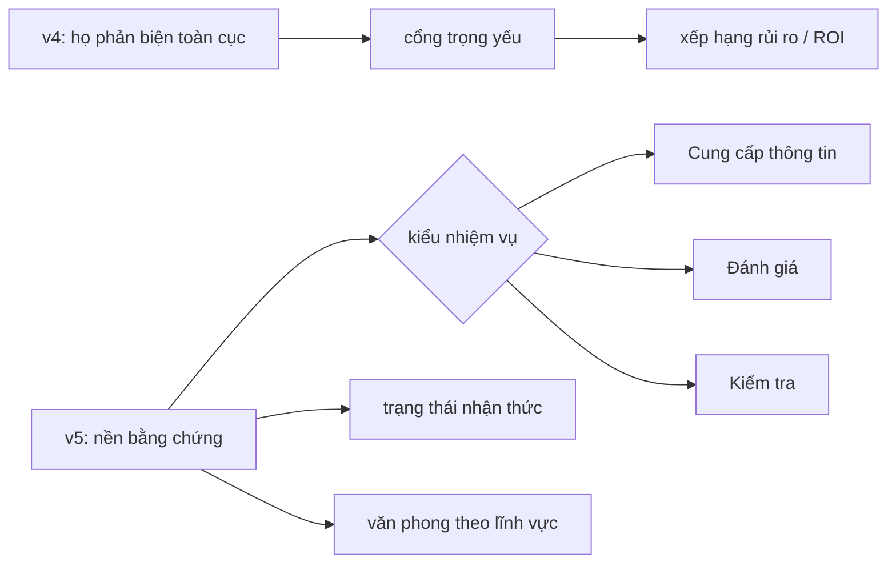

# Kiểm toán lịch sử phiên bản, tiến hóa kiến trúc và phân tích changelog CI

## 0. Phạm vi và quy tắc bằng chứng

Bản kiểm toán này bao phủ 19 tệp phiên bản, `Changelog.txt`, tài liệu giải thích thiết kế và bối cảnh triển khai do tác giả cung cấp. Các tệp phiên bản là bằng chứng chính cho thay đổi văn bản/ngữ nghĩa. Bối cảnh triển khai có thẩm quyền đối với design intent: hai thư mục là hai mục tiêu ngân sách ký tự, còn v6.3 chuyển đổi là bản chưng cất rollback-safe từ v7.3 để khi quay về Free/Go không phải quay lại semantics v6.2. `ci_design_rationale_v3_vi_invariant.md` là tài liệu giải thích kiến trúc, không phải phiên bản CI thực thi riêng.

Nhãn bằng chứng:

- **Quan sát:** đọc trực tiếp được từ nguồn.
- **Suy luận:** hệ quả ngữ nghĩa được văn bản hỗ trợ nhưng không được phát biểu nguyên văn.
- **Chưa xác định:** nguồn không đủ để kết luận.

Loại phiên bản được suy ra từ cách đánh số, trừ khi có bằng chứng mạnh hơn. Người dùng đã xác nhận `chatgpt v6.3_7.3 converted.txt` là **Major (bản chính)**; xác nhận này có ưu tiên cao hơn quy tắc mặc định cho hậu tố `.3`.

## 1. Danh mục phiên bản

| Phiên bản | Loại | Bản cha dùng để kiểm toán | Phạm vi | Ghi chú |
| --- | --- | --- | --- | --- |
| v1.0 | Major | Không có | Toàn bộ CI | Kiến trúc kiểm toán thực chứng cho phần cứng và dữ liệu thời gian thực. |
| v2.0 | Major | v1.0 | Toàn bộ CI | Thay giao thức v1 bằng kiến trúc Biên tập viên cấp cao ngắn gọn. |
| v2.1 | Patch | v2.0 | Văn phong, mật độ, làm rõ | Kế thừa văn bản mạnh từ v2.0. Không thay đổi kiến trúc toàn cục. |
| v2.2 | Patch | v2.1 | Nén và trạng thái nhận thức | Kế thừa mạnh từ v2.1. Không thay đổi kiến trúc toàn cục. |
| v3.0 | Major | v2.2 | Toàn bộ CI | Thay hệ biên tập/định dạng bằng bộ phản biện kiểu kỹ sư thực dụng. |
| v3.1 | Patch | v3.0 | Vai trò phản biện và ngưỡng làm rõ | Thêm đánh giá kiến trúc, ROI, xếp hạng rủi ro và tính trọng yếu. |
| v4.0 | Major | v3.1 | Điều kiện phản biện và vai trò | Mang số Major nhưng nguồn chỉ cho thấy điều chỉnh kiến trúc cục bộ. |
| v5.0 | Major | v4.0 | Toàn bộ CI | Thêm trạng thái nhận thức, kiểu phản hồi, phong cách theo lĩnh vực và suy luận dựa trên bằng chứng. |
| v5.1 | Patch | v5.0 | Phạm vi sự thật và MECE | Viết lại quy tắc đầu và bỏ một số ràng buộc bề mặt của v5.0. |
| v6.0 | Major | v5.1 | Toàn bộ CI | Thêm “bộ não thứ hai”, định tuyến chính xác, khả năng bác bỏ và quy tắc đại từ/chủ thể đầu tiên. |
| v6.1 | Patch | v6.0 | Phát biểu, ngữ cảnh, kiểu phản hồi, cú pháp tiếng Việt | Sửa xung đột về tiền đề và tăng cường cấu trúc câu theo chủ thể. |
| v6.2 | Patch | v6.1 | Thuật ngữ tiếng Việt | Thêm quy tắc tránh tiếng Anh không cần thiết; bỏ câu kỹ thuật/phi kỹ thuật. |
| v7.0 | Major | v6.2 | Toàn bộ CI | Mở rộng các quy tắc v6 thành định nghĩa vận hành rõ ràng. |
| v7.1 | Patch | v7.0 | Ưu tiên tiếng Việt, cập nhật, độ mới | Tăng cường thuật ngữ, lan truyền thay đổi tiền đề và tìm kiếm thông tin mới. |
| v7.2 | Patch | v7.1 | Ngoại lệ thuật ngữ, khả năng thay thế, phong cách lĩnh vực | Làm mềm dịch thuật quá mức và chống kết luận nguyên nhân quá sớm. |
| v7.3 | Patch có tác động kiến trúc | v7.2 | Mô-đun hóa, thứ tự ưu tiên, định tuyến | Giữ họ quy tắc chính nhưng làm rõ thứ bậc bất biến và rào chắn. |
| v7.3.1 | Patch | v7.3 | Định dạng cuối tệp | Đồng nhất ngữ nghĩa với v7.3; khác biệt byte duy nhất là không có ký tự xuống dòng cuối. |
| v7.4 | Patch có tác động kiến trúc | v7.3.1 | Định tuyến theo vai trò, phạm vi sự thật, suy luận kỹ thuật, văn phong | Thay thứ bậc bất biến/rào chắn bằng `vai trò → kiểu phản hồi → suy luận → lập trường`, khôi phục phạm vi hệ do người dùng định nghĩa và bỏ một số rào chắn rõ. |
| v6.3 chuyển đổi | **Major** | v7.3 | Toàn bộ CI chuyển đổi | Major rollback-safe cho Free/Go. Bản này cố ý chưng cất v7.3 để việc hạ gói không khôi phục semantics v6.2; không phải bản cha của v7.0. |

### Quan sát về danh mục

- Có 19 tệp phiên bản: 8 Major và 11 Patch theo quy tắc bằng chứng trên.
- Không có tệp `v6.3` đơn giản; toàn bộ tên tệp xác định bản chính chuyển đổi.
- `chatgpt v7.3.txt` là nguồn độc lập, không thể thay thế cho bản v6.3 chuyển đổi.
- Theo bối cảnh tác giả, `ChatGPT Go-Free Era` và `ChatGPT Plus+ Era` là hai mục tiêu triển khai theo ngân sách ký tự, không chỉ là thư mục thời kỳ.
- Các tệp không chứa thời gian phát hành, trường `parent` hoặc siêu dữ liệu lineage cho các chuỗi patch sớm.
- Chuỗi `v2.0 → v2.1 → v2.2`, `v6.0 → v6.1 → v6.2` và `v7.0 → v7.1 → v7.2 → v7.3 → v7.3.1 → v7.4` có độ tin cậy cao. v7.3.1 khác ở mức byte nhưng đồng nhất ngữ nghĩa với v7.3; v7.4 mới là lần viết lại thực chất.

## 2. Lineage phiên bản

```mermaid
flowchart LR
    V1["v1.0 Major"] --> V2["v2.0 Major"]
    V2 --> V21["v2.1 Patch"] --> V22["v2.2 Patch"]
    V22 --> V3["v3.0 Major"] --> V31["v3.1 Patch"] --> V4["v4.0 Major"]
    V4 --> V5["v5.0 Major"] --> V51["v5.1 Patch"] --> V6["v6.0 Major"]
    V6 --> V61["v6.1 Patch"] --> V62["v6.2 Patch"] --> V7["v7.0 Major"]
    V7 --> V71["v7.1 Patch"] --> V72["v7.2 Patch"] --> V73["v7.3 Patch có tác động kiến trúc"]
    V73 --> V731["v7.3.1 Patch chỉ định dạng"] --> V74["v7.4 Patch có tác động kiến trúc"]
    V73 -->|"chưng cất / chuyển đổi"| C63["v6.3 chuyển đổi Major"]
```

Cạnh cuối được xác lập trực tiếp bởi `ChatGPT Go-Free Era/Changelog.txt:1` và xác nhận loại Major của người dùng. Sắp xếp thuần số sẽ đặt sai v6.3 chuyển đổi trước v7.0.

## 3. Tóm tắt điều hành

Lịch sử có bảy thời kỳ kiến trúc lớn, không phải 19 lần thiết kế lại:

1. **v1.0 — giao thức thực chứng chuyên biệt:** gộp kiểm chứng phần cứng thời gian thực, xác thực ba thành phần, trích xuất thô, trigger lệnh, đầu ra cạn kiệt và tiếng Việt bắt buộc vào một khối đơn.
2. **v2.x — giao thức biên tập gọn:** thay hệ phần cứng bằng Biên tập viên cấp cao, giới hạn độ dài, kết luận trước, quét lỗi và hướng mở rộng. v2.1 tinh chỉnh lặp ý/phản ứng xã hội; v2.2 nén hệ thống và thêm phân biệt sự thật/suy luận/giả định.
3. **v3.x–v4.0 — bộ phản biện đối kháng:** bỏ khung biên tập để chuyển sang phản biện trực diện. v3.1 thêm kiến trúc, ROI và xếp hạng rủi ro. v4.0 giới hạn phản biện vào các trường hợp ảnh hưởng trọng yếu tới quyết định.
4. **v5.x — kiến trúc nhận thức và nhận biết nhiệm vụ:** phản biện không còn là mặc định. Hệ thống thêm quan sát/suy luận/giả định/kết luận, các cách hiểu thay thế, Cung cấp thông tin/Đánh giá/Kiểm tra, phong cách theo lĩnh vực và kiểm chứng thông tin có tính thời điểm.
5. **v6.x–v7.2 — bộ quy tắc “bộ não thứ hai” được mở rộng:** v6.0 thêm định tuyến chính xác, khả năng bác bỏ và quy tắc đại từ nhưng tạo xung đột về tiền đề. v6.1 sửa xung đột, thêm cô lập hội thoại và nâng quy tắc tiếng Việt từ xóa đại từ thành dựng câu theo chủ thể. v6.2 thêm thuật ngữ tiếng Việt. v7.0 mở rộng cách vận hành; v7.1 thêm lan truyền cập nhật và độ mới; v7.2 sửa quy tắc thuật ngữ và tăng cường xử lý mơ hồ/phong cách.
6. **v7.3 và v6.3 chuyển đổi — thứ bậc bất biến/rào chắn cùng hai mục tiêu triển khai:** v7.3 đặt cấu trúc chủ thể và thuật ngữ ở tầng bất biến, thêm kiểm chứng khả năng sản phẩm/runtime và đặt tính đúng đắn cao hơn văn phong. v6.3 chuyển đổi chưng cất kiến trúc v7.3 cho mục tiêu Free/Go.
7. **v7.3.1–v7.4 — chuẩn hóa no-op rồi chuyển sang topology theo vai trò:** v7.3.1 chỉ đổi định dạng EOF. v7.4 thay thứ bậc có tên bằng `vai trò → kiểu phản hồi → suy luận → lập trường`, khôi phục phạm vi sự thật cho hệ do người dùng định nghĩa và tăng chiều sâu kỹ thuật, nhưng bỏ lan truyền cập nhật, cô lập hội thoại và một số rào chắn ngôn ngữ rõ.

### Bất biến ứng viên quan trọng

- **R04 — kỷ luật bằng chứng:** có dạng chuyên biệt ở v1, được tổng quát hóa tại v5 và rõ ràng từ v6. v6.0 có xung đột ngữ nghĩa; v6.1 sửa xung đột.
- **R05 — tách trạng thái nhận thức:** có tiền thân rõ tại v2.2 và trở thành kiến trúc ổn định từ v5.
- **R07 — định tuyến kiểu phản hồi:** xuất hiện từ v5; thứ tự ưu tiên thay đổi ở v7.3 để một phát biểu đơn thuần không tự động ép Kiểm tra.
- **R02/R03 — cấu trúc chủ thể và thuật ngữ tiếng Việt:** R02 bắt đầu tại v6.0 và thành bất biến chính ở v7.3; R03 bắt đầu tại v6.2 và thành bất biến hỗ trợ. Đây là bất biến của kiến trúc hiện tại, không phải toàn bộ lịch sử.

### Phát hiện hồi quy quan trọng

- **Xung đột nội bộ đã xác nhận ở v6.0:** dòng 1 đòi bằng chứng độc lập trước khi đồng ý, trong khi dòng 9 coi mọi tiền đề được nêu là đúng nếu không được yêu cầu kiểm tra thực tế. v6.1 bỏ quy tắc tiền đề bao trùm và tách phát biểu khách quan khỏi ý kiến/quan sát.
- **Ứng viên hồi quy ở v5.1:** quy tắc kiểm chứng thông tin có tính thời điểm của v5.0 biến mất tới v7.1.
- **Ứng viên hồi quy ở v6.1:** yêu cầu nêu điều kiện bác bỏ cho mọi kết luận không tầm thường biến mất, trở lại ở v7.0 và được giới hạn phạm vi ở v7.3.
- **Ứng viên hồi quy ở v7.3:** “tìm kiếm trước khi trả lời” đổi thành “kiểm chứng khi độ mới có thể ảnh hưởng”, làm yếu cơ chế cụ thể nhưng giữ bảo đảm về độ mới.
- **Ứng viên hồi quy ở v7.4:** lan truyền cập nhật và cô lập liên hội thoại biến mất; rào chắn xóa đại từ hậu kỳ cùng thứ bậc ngôn ngữ có tên bị bỏ; yêu cầu điều kiện bác bỏ chung bị thu hẹp về kết luận kỹ thuật quan trọng.
- **Trade-off chuyển đổi có chủ đích ở v6.3:** bỏ độ mới, cô lập hội thoại, xử lý kỹ thuật/phi kỹ thuật, điều kiện phân biệt/bác bỏ và ưu tiên đúng đắn hơn văn phong để vừa ngân sách Free/Go. Đây là rủi ro parity cần kiểm thử, chưa phải hồi quy đã xác nhận.

## 4. Định danh quy tắc đã chuẩn hóa

| ID | Khái niệm chuẩn hóa | Xuất hiện đầu | Hoạt động patch | Trạng thái tại v7.4 / v6.3 chuyển đổi | Ghi chú |
| --- | --- | --- | --- | --- | --- |
| R01 | Nền tảng đầu ra tiếng Việt | v1.0 | Giữ tới v2.2; vắng mặt v3–v5; tái cấu trúc qua R02/R03 từ v6 | Đã sửa đổi | Không đồng nhất “trả lời bằng tiếng Việt” với cấu trúc tiếng Việt. |
| R02 | Cú pháp tiếng Việt lấy chủ thể nội dung làm trung tâm | v6.0 | v6.1 tăng cường; v7.3 đặt thành bất biến chính; v7.4 bỏ rào chắn hậu kỳ và ưu tiên có tên | Đã sửa đổi / làm yếu | Lõi còn ở v7.4; dạng mạnh hơn của v7.3 còn trong bản chuyển đổi. |
| R03 | Thuật ngữ tiếng Việt và ngoại lệ tiếng Anh cần thiết | v6.2 | v7.1 tăng mạnh; v7.2 làm mềm; v7.3 hệ thống hóa; v7.4 đơn giản hóa; bản chuyển đổi làm mềm theo độ nhận biết | Đã sửa đổi / làm yếu | v7.4 bỏ nhãn bất biến hỗ trợ và mệnh đề “phổ biến không đủ”. |
| R04 | Kiểm chứng phát biểu khách quan | Tiền thân v1; dạng tổng quát v5 | v6.0 xung đột; v6.1 tách phát biểu/ý kiến; v7.3 giữ trạng thái; v7.4 để vai trò phát biểu chọn kiểu | Đang hoạt động / đã sửa đổi | v7.4 vẫn không tự động tán thành đầu vào chưa kiểm chứng. |
| R05 | Tách quan sát/suy luận/giả định/kết luận | Tiền thân v2.2; dạng đầy đủ v5 | Mở rộng v7.2–v7.3; v7.4 ràng buộc theo ảnh hưởng; nén ở bản chuyển đổi | Đang hoạt động / đã sửa đổi | v7.4 chỉ biểu hiện rõ khi đúng đắn hoặc quyết định bị ảnh hưởng. |
| R06 | Giữ các khả năng còn phù hợp và điều kiện phân biệt | v5.0 | v6 thêm bác bỏ; v7.2 chống kết luận sớm; v7.3 thêm điều kiện phân biệt; v7.4 ràng buộc theo ích lợi | Đã sửa đổi | Bản chuyển đổi bỏ chi tiết về điều kiện phân biệt. |
| R07 | Cung cấp thông tin / Đánh giá / Kiểm tra | v5.0 | v6 bắt buộc đúng một kiểu; v7.3 dùng một kiểu chính; v7.4 chèn vai trò trước kiểu và lập trường sau suy luận | Đã sửa đổi | v7.4 tiếp tục đổi topology nhưng giữ phát biểu không ép Kiểm tra. |
| R08 | Ngưỡng làm rõ khi mơ hồ có tính trọng yếu | Tiền thân v3.0 | v3.1 thêm trọng yếu; v6 siết; v7.3 cho phép giả định nhỏ nhất | Đang hoạt động | Tránh chặn nhiệm vụ vì mơ hồ không ảnh hưởng kết luận. |
| R09 | Chỉ cập nhật theo bằng chứng mới và lan truyền thay đổi tiền đề | v7.1 | Giữ qua v7.3 và bản chuyển đổi; bỏ ở v7.4 | Bị bỏ ở v7.4 | Hồ sơ fallback giữ một safeguard không còn rõ trong mainline Plus. |
| R10 | Cô lập hội thoại/ngữ cảnh | v6.1 | Giữ tới v7.3; bỏ ở v7.4 và bản chuyển đổi | Đã bỏ | v7.4 không có quy tắc thay thế cho cô lập liên hội thoại. |
| R11 | Kiểm chứng thông tin mới/có tính thời điểm | v1 chuyên biệt; v5 tổng quát | Bỏ v2/v5.1; trở lại v7.1; làm mềm v7.3; mở rộng danh mục v7.4; bỏ ở bản chuyển đổi | Hoạt động ở v7.4; bỏ ở bản chuyển đổi | v7.4 gắn kiểm chứng với ảnh hưởng trọng yếu của độ mới. |
| R12 | Xử lý kỹ thuật và phi kỹ thuật | v5.0 | Bỏ v6.2; trở lại v7.0; mở rộng v7.3; tách giữa Kỹ thuật và Văn phong ở v7.4; bỏ ở bản chuyển đổi | Hoạt động ở v7.4; bỏ ở bản chuyển đổi | v7.4 tăng cơ chế kỹ thuật và mở rộng cấm suy diễn cá nhân. |
| R13 | Độ sâu và văn phong theo lĩnh vực | v5.0 | Bỏ v6.1–v7.1; trở lại v7.2; mô-đun hóa v7.3 | Đang hoạt động | Bản chuyển đổi giữ dạng nén. |
| R14 | Phản biện trực diện và chống làm mềm xã hội | v1.0 | v4 thêm điều kiện trọng yếu; v5 chuyển vào kiểu Kiểm tra | Đã hợp nhất | Không còn là văn phong toàn cục. |
| R15 | Ngắn gọn, mật độ và cấu trúc có điều kiện | v2.0 | Giới hạn câu biến mất v3; chuyển thành giá trị thông tin từng câu; v7.3 làm mềm biểu hiện báo cáo | Đang hoạt động | Từ giới hạn độ dài sang giá trị thông tin. |
| R16 | Phạm vi nhiệm vụ và phạm vi sự thật | v5.1 | v6.0 mở quá rộng; v6.1 thay thế; v7.4 khôi phục cho hệ do người dùng định nghĩa | Được khôi phục | Tính nhất quán nội bộ và độ đúng thực tế được tách phạm vi trở lại. |
| R17 | Xác thực phần cứng đa nguồn và dữ liệu thô | v1.0 | Bỏ ở v2.0 | Đã bỏ | Không có tương đương đầy đủ về ba nguồn/SKU/benchmark. |
| R18 | Hệ trigger và precedence định dạng | v1.0 | Bỏ ở v2.0 | Đã bỏ | Gồm `@Update`, `@Current`, `@Full`, `@Logic`, `@Crit`, `@Table`, `@Step`, `EXIT_CORE`. |
| R19 | Quét lỗi và hướng mở rộng | v2.0 | Giữ đến v2.2; bỏ ở v3.0 | Đã bỏ | Mô-đun đầu ra, không phải bất biến lâu dài. |
| R20 | Không suy diễn tính cách/động cơ thiếu bằng chứng | v3.0 | Tổng quát hóa ở v5; trở lại v7; v7.4 mở rộng tới động cơ/sở thích/cảm xúc/danh tính/đặc điểm; bỏ trong bản chuyển đổi | Hoạt động ở v7.4; bỏ ở bản chuyển đổi | v7.4 chuyển rào chắn vào Văn phong. |
| R21 | Khả năng bác bỏ kết luận không tầm thường | v6.0 | Bỏ v6.1–v6.2; trở lại v7.0; giới hạn v7.3; thu hẹp về kết luận kỹ thuật quan trọng ở v7.4; bỏ trong bản chuyển đổi | Đã sửa đổi ở v7.4; bỏ ở bản chuyển đổi | Kết luận hệ trọng nói chung không còn cùng độ phủ rõ. |
| R22 | MECE khi có ích | v5.1 | Làm có điều kiện ở v6.0; bỏ v6.1 | Đã bỏ | Không có tương đương chính xác về sau. |
| R23 | Kiểm chứng khả năng sản phẩm/runtime có thể kiểm tra từ bên ngoài | v7.3 | Thêm vào v7.3 hiện hành; giữ nguyên v7.3.1; hợp nhất vào Suy luận/Thông tin hiện hành ở v7.4 | Đã sửa đổi | Kiểm chứng trực tiếp còn; ưu tiên tài liệu nhà cung cấp/trạng thái trực tiếp bị bỏ. |

## 5. Changelog theo từng phiên bản

### v1.0

**Loại:** Major  
**So với:** Không có

- **Đã thêm:** dữ liệu thời gian thực cho phần cứng sau cut-off, `[Thiếu dữ liệu]`, xác thực ba thành phần, trích xuất thô và báo cáo xung đột song song.
- **Đã thêm:** trạng thái giả định `what/if`, vai trò Kiểm toán viên thực chứng, trigger lệnh/định dạng, `EXIT_CORE`, đầu ra cạn kiệt, ba nguồn cho claim quan trọng và tiếng Việt bắt buộc.
- **Tác động kiến trúc:** CI đơn khối, thiên về phần cứng, điều khiển bằng lệnh.

### v2.0

**Loại:** Major  
**So với:** v1.0

- **Đã thêm:** vai trò Biên tập viên cấp cao, câu trả lời tiếng Việt ngắn, giải thích thuật ngữ, kết luận trước, Quét lỗi và Hướng mở rộng.
- **Đã bỏ:** xác thực phần cứng/thời gian thực, trích xuất thô, trigger, `EXIT_CORE`, đầu ra cạn kiệt và số nguồn cố định.
- **Thay đổi ngữ nghĩa:** chuyển từ kiểm toán thực chứng cạn kiệt sang giải thích biên tập gọn.
- **Ứng viên hồi quy:** R17 và R18 bị bỏ toàn bộ; chủ đích không xác định từ nguồn.

### v2.1

**Loại:** Patch  
**So với:** v2.0

- **Đã thêm:** giới hạn lặp cấu trúc chuyển ý, cấm phản ứng xã hội không mang thông tin, kết luận trước có điều kiện, chỉ dùng cấu trúc khi giúp rõ hơn, ngoại lệ thuật ngữ chính xác và danh sách cụm từ cấm.
- **Thay đổi ngữ nghĩa:** thuật ngữ kỹ thuật được phép khi tăng độ chính xác; Markdown/kết luận trước không còn tuyệt đối.
- **Tác động kiến trúc:** không thay đổi kiến trúc toàn cục.

### v2.2

**Loại:** Patch  
**So với:** v2.1

- **Đã thêm:** phân biệt sự thật, suy luận và giả định.
- **Đã bỏ:** thông báo bắt buộc khi giản lược, ví dụ đời thường, mẫu đầu ra cố định và giới hạn lặp chuyển ý.
- **Thay đổi ngữ nghĩa:** nén quy tắc chi tiết thành nguyên tắc chung; mất một phần sắc thái vận hành.
- **Tác động kiến trúc:** không thay đổi kiến trúc toàn cục.

### v3.0

**Loại:** Major  
**So với:** v2.2

- **Đã thêm:** phản biện toàn cục đối với giả định, mâu thuẫn, chi phí ẩn, thiên kiến và overengineering; văn phong kỹ sư thực dụng; tách điểm mạnh/yếu/bất định/đánh đổi; quy trình ba câu hỏi làm rõ.
- **Đã bỏ:** vai trò Biên tập viên, giới hạn câu, kết luận trước, mẫu Markdown, Quét lỗi và Hướng mở rộng.
- **Thay đổi ngữ nghĩa:** phản biện trở thành hành vi mặc định toàn cục.

### v3.1

**Loại:** Patch  
**So với:** v3.0

- **Đã thêm:** Kiểm tra kiến trúc + Kỹ sư thực dụng, độ đúng, giảm rủi ro, ROI, xếp hạng tác động/xác suất và ưu tiên bây giờ/sau/không bao giờ.
- **Thay đổi:** chỉ làm rõ khi thiếu dữ liệu có thể thay đổi đáng kể kết luận; không tự tổng kết người dùng.
- **Đã làm yếu:** bỏ “không bảo vệ ý tưởng tệ khỏi phê bình”.

### v4.0

**Loại:** Major  
**So với:** v3.1

- **Thay đổi ngữ nghĩa:** chỉ phản biện giả định/chi phí ẩn khi ảnh hưởng trọng yếu đến quyết định, kết luận, kế hoạch hoặc yêu cầu khuyến nghị.
- **Đổi vai trò:** Kiểm tra kiến trúc thành Cố vấn + Kiểm tra kiến trúc.
- **Tác động kiến trúc:** thay đổi cục bộ về điều kiện kích hoạt, không phải thiết kế lại toàn bộ.

### v5.0

**Loại:** Major  
**So với:** v4.0

- **Đã thêm:** đúng đắn/bằng chứng trước, tách trạng thái nhận thức, các cách hiểu có điều kiện, cơ chế kỹ thuật và giới hạn suy diễn phi kỹ thuật, văn phong theo lĩnh vực, Cung cấp thông tin/Đánh giá/Kiểm tra và kiểm chứng thông tin có tính thời điểm.
- **Đã bỏ/hợp nhất:** văn phong phê bình khắc nghiệt, vai trò Cố vấn hỗn hợp, ROI/xếp hạng rủi ro; phản biện được giữ trong kiểu Kiểm tra.
- **Tác động kiến trúc:** thiết kế lại từ persona sang định tuyến nhiệm vụ và rào chắn nhận thức.

### v5.1

**Loại:** Patch  
**So với:** v5.0

- **Đã thêm:** phạm vi nhiệm vụ, phạm vi sự thật, quyền ưu tiên của tiền đề trong mô hình do người dùng định nghĩa và MECE có điều kiện.
- **Đã bỏ:** trả lời trước, ranh giới mở rộng liên quan, cấm trôi chủ đề và kiểm chứng thông tin có tính thời điểm.
- **Ứng viên hồi quy:** R11 biến mất tới v7.1.

### v6.0

**Loại:** Major  
**So với:** v5.1

- **Đã thêm:** mục tiêu “bộ não thứ hai”, đúng một kiểu phản hồi, định tuyến mặc định, điều kiện bác bỏ, kiểm tra giá trị từng câu, ngưỡng cấu trúc và quy tắc giảm đại từ tiếng Việt.
- **Thay đổi:** quyền của tiền đề được mở rộng từ mô hình do người dùng định nghĩa sang mọi tiền đề được nêu.
- **Xung đột đã xác nhận:** dòng 1 yêu cầu bằng chứng độc lập nhưng dòng 9 chấp nhận tiền đề nếu không được yêu cầu kiểm tra thực tế.

### v6.1

**Loại:** Patch  
**So với:** v6.0

- **Đã thêm:** tách phát biểu khách quan khỏi ý kiến/quan sát, cô lập hội thoại, chọn kiểu theo tin nhắn hiện tại và dựng câu tiếng Việt theo chủ thể.
- **Đã bỏ:** chấp nhận tiền đề bao trùm, điều kiện bác bỏ kết luận không tầm thường, MECE, văn phong theo lĩnh vực và ngưỡng cấu trúc.
- **Đã sửa:** xung đột bằng chứng/tiền đề của v6.0.

### v6.2

**Loại:** Patch  
**So với:** v6.1

- **Đã thêm:** ưu tiên thuật ngữ tiếng Việt tự nhiên; chỉ giữ tiếng Anh khi không có tương đương tiếng Việt thực sự.
- **Đã bỏ:** câu quy định cơ chế/đánh đổi kỹ thuật và cấm suy diễn động cơ/cảm xúc ở chủ đề phi kỹ thuật.
- **Tác động kiến trúc:** không thay đổi kiến trúc toàn cục.

### v7.0

**Loại:** Major  
**So với:** v6.2

- **Đã mở rộng:** định nghĩa phát biểu/ý kiến, cô lập hội thoại, kiểu phản hồi, trạng thái nhận thức, mơ hồ và khả năng bác bỏ.
- **Đã khôi phục:** xử lý kỹ thuật/phi kỹ thuật, điều kiện bác bỏ kết luận không tầm thường và cấu trúc có điều kiện.
- **Thay đổi:** Cung cấp thông tin cấm đánh giá/khuyến nghị; Kiểm tra là mặc định cho quyết định hoặc phát biểu khách quan đã có.

### v7.1

**Loại:** Patch  
**So với:** v7.0

- **Đã thêm:** đưa hai quy tắc tiếng Việt lên đầu; ép mọi từ sang tiếng Việt nếu có từ tương đương; lan truyền thay đổi tiền đề; tìm kiếm bắt buộc cho thông tin có thể cũ.
- **Thay đổi cường độ:** R03 được siết mạnh, có nguy cơ tạo bản dịch kỹ thuật gượng; R11 chuyển từ kiểm chứng sang tìm kiếm rõ ràng.

### v7.2

**Loại:** Patch  
**So với:** v7.1

- **Đã thêm:** chống kết luận nguyên nhân quá sớm và văn phong phù hợp chat thường, kỹ thuật, worldbuilding, hư cấu.
- **Đã sửa:** cho phép giữ thuật ngữ tiếng Anh đã ổn định khi dịch sẽ gây hiểu sai hoặc gượng.
- **Lỗi từ vựng:** ký tự `s` đơn lẻ ở cuối tệp không có bằng chứng về ý nghĩa ngữ nghĩa.

### v7.3

**Loại:** Patch có tác động kiến trúc  
**So với:** v7.2

- **Đã thêm:** mô-đun có tên cho bằng chứng, cập nhật, trạng thái nhận thức, kiểu phản hồi, mơ hồ, độ mới, ngữ cảnh, độ sâu/văn phong và ưu tiên.
- **Đã thêm precedence:** cấu trúc chủ thể là bất biến chính, thuật ngữ là bất biến hỗ trợ, các quy tắc khác là rào chắn có thể làm mềm; đúng đắn cao hơn văn phong.
- **Đã thêm kiểm chứng sản phẩm/runtime:** phải kiểm chứng claim có thể kiểm tra từ bên ngoài trước khi dùng làm tiền đề; ưu tiên tài liệu nhà cung cấp hoặc trạng thái sản phẩm trực tiếp và không suy diễn khả năng từ tính năng lân cận.
- **Thay đổi ngữ nghĩa:** phát biểu đơn thuần không ép Kiểm tra; mơ hồ không trọng yếu có thể dùng giả định nhỏ nhất; Cung cấp thông tin có thể thêm đánh giá khi cần.
- **Làm yếu cơ chế độ mới:** “tìm kiếm trước khi trả lời” thành “kiểm chứng khi độ mới có thể ảnh hưởng”.

### v7.3.1

**Loại:** Patch

**So với:** v7.3

- **Thay đổi định dạng:** bỏ ký tự xuống dòng cuối tệp.
- **Tác động ngữ nghĩa/kiến trúc:** không có; so sánh bỏ qua khoảng trắng cuối dòng cho kết quả đồng nhất với v7.3.

### v7.4

**Loại:** Patch có tác động kiến trúc

**So với:** v7.3.1

- **Đã thêm topology:** `vai trò → kiểu phản hồi → suy luận → lập trường`; vai trò của claim quyết định kiểu trước khi suy luận quyết định đồng ý, giới hạn, bất định hay phản đối.
- **Đã thêm phạm vi sự thật:** định nghĩa/bất biến của framework, kiến trúc, hệ hư cấu và mô hình khái niệm do người dùng định nghĩa có thẩm quyền bên trong mô hình, trừ khi nhiệm vụ chuyển sang độ đúng thực tế.
- **Đã tăng chiều sâu kỹ thuật:** cơ chế, quan hệ nhân quả, giả định, đánh đổi, failure mode, bằng chứng định lượng và điều kiện làm kết luận quan trọng không còn đúng.
- **Đã mở rộng:** danh mục thông tin hiện hành, lệnh cấm suy diễn khả năng từ tính năng lân cận, và biên văn phong cho phép phép tương tự/ẩn dụ kỹ thuật/hài khô/mỉa mai khi tự nhiên.
- **Đã thay đổi:** gộp cấu trúc chủ thể và thuật ngữ vào một mô-đun; mở rộng Đánh giá/Kiểm tra; trạng thái nhận thức và khả năng thay thế trở thành ràng buộc theo ảnh hưởng hoặc ích lợi.
- **Đã bỏ/làm yếu:** rào chắn xóa đại từ hậu kỳ, thứ bậc bất biến chính/hỗ trợ có tên, toàn bộ quy tắc lan truyền cập nhật, cô lập liên hội thoại, ưu tiên nguồn nhà cung cấp/trạng thái trực tiếp và điều kiện bác bỏ chung ngoài phạm vi kỹ thuật.
- **Tác động kiến trúc:** chuyển từ hierarchy cố định của v7.3 sang pipeline xử lý theo vai trò. Tính thích ứng và khả năng kiểm tra suy luận kỹ thuật tăng, nhưng độ phủ một số failure mode giảm.

### v6.3 chuyển đổi

**Loại:** **Major**  
**So với:** v7.3

- **Đã giữ/nén:** hai bất biến tiếng Việt, trạng thái bằng chứng, lan truyền cập nhật, trạng thái nhận thức, các khả năng còn phù hợp, ba kiểu phản hồi, ngưỡng mơ hồ, giả định nhỏ nhất và văn phong theo lĩnh vực.
- **Đã bỏ theo trade-off triển khai:** độ mới, cô lập ngữ cảnh, kỹ thuật/phi kỹ thuật, rào chắn jargon, điều kiện phân biệt/bác bỏ, ưu tiên đúng đắn hơn văn phong và quy tắc làm mềm rào chắn chung để vừa ngân sách Free/Go.
- **Thay đổi:** tiếng Anh được giữ khi rõ ràng dễ nhận biết hoặc chính xác hơn; sự phổ biến đơn thuần vẫn không đủ.
- **Tác động kiến trúc:** chuyển đổi lớn bằng chưng cất ngữ nghĩa có chủ đích; giữ lõi v7.3 để việc hạ gói không quay về v6.2, đồng thời chấp nhận rủi ro parity do giảm độ phủ rõ.

## 6. Tiến hóa kiến trúc giữa các Major

### v1.0 → v2.0

- Kiểm toán phần cứng điều khiển bằng lệnh chuyển thành mẫu biên tập tổng quát, ngắn.
- Xóa xác thực phần cứng, số nguồn, trích xuất thô và precedence trigger.
- Tổng quát hơn nhưng mất bảo đảm bằng chứng chuyên biệt.

### v2.0 → v3.0

- Biên tập viên có mô-đun đầu ra chuyển thành bộ phản biện đối kháng toàn cục.
- Ràng buộc phản biện mạnh hơn; giới hạn độ dài và định dạng biến mất.

### v3.0 → v4.0

- Họ kiến trúc phản biện được giữ nguyên.
- Thêm cổng trọng yếu trước khi kích hoạt phản biện.

### v4.0 → v5.0

- Persona phản biện chuyển thành bộ định tuyến nhiệm vụ trên nền bằng chứng.
- Thêm ba kiểu phản hồi, trạng thái nhận thức, cách hiểu thay thế, văn phong theo lĩnh vực và độ mới.
- Phản biện trở thành hành vi theo nhiệm vụ thay vì mặc định.

### v5.0 → v6.0

- Ba kiểu linh hoạt chuyển thành đúng một kiểu với định tuyến mặc định và khả năng bác bỏ.
- Quy tắc chủ thể/đại từ tiếng Việt xuất hiện lần đầu.
- Xuất hiện lỗi precedence giữa bằng chứng độc lập và chấp nhận tiền đề.

### v6.0 → v7.0

- Danh sách gọn được mở rộng thành đặc tả vận hành.
- v6.1 cung cấp tách phát biểu/ý kiến, ngữ cảnh, định tuyến theo tin nhắn và cấu trúc chủ thể; v6.2 cung cấp thuật ngữ.
- v7.0 tích hợp hai patch và khôi phục kỹ thuật/phi kỹ thuật cùng khả năng bác bỏ. Văn phong theo lĩnh vực chỉ trở lại ở v7.2.

### v7.0 → v7.4 và nhánh v7.3 → v6.3 chuyển đổi

- Mainline: v7.1 thêm cập nhật/độ mới và siết thuật ngữ; v7.2 sửa thuật ngữ/mơ hồ; v7.3 tạo thứ bậc bất biến/rào chắn và thêm kiểm chứng sản phẩm/runtime; v7.3.1 chỉ đổi định dạng; v7.4 thay hierarchy bằng pipeline theo vai trò.
- Nhánh chuyển đổi: v6.3 tách từ v7.3, không phải v7.4, và chưng cất lõi v7.3 cho ngân sách Free/Go.
- Precedence đổi từ `cấu trúc chủ thể → thuật ngữ → rào chắn` ở v7.3 thành `vai trò → kiểu phản hồi → suy luận → lập trường` ở v7.4; đúng đắn vẫn cao hơn văn phong.

## 7. Tiến hóa bất biến

### Cấu trúc chủ thể tiếng Việt — R02

- **Xuất hiện đầu:** v6.0.
- **v6.0:** bỏ đại từ khi câu vẫn rõ.
- **v6.1:** phải dựng câu từ đầu quanh chủ thể đang bàn; xóa đại từ sau khi viết là không đủ.
- **v7.3:** thành bất biến chính, có ngoại lệ khi người nói/nghe thực sự là chủ thể.
- **v7.4:** giữ cách dựng câu quanh chủ thể nhưng bỏ cảnh báo xóa đại từ hậu kỳ và nhãn ưu tiên bất biến chính.
- **v6.3 chuyển đổi:** được giữ ở vị trí đầu và mức ưu tiên cao nhất.
- **Đánh giá:** lõi vẫn là bất biến hiện hành, nhưng ngôn ngữ thực thi rõ đã yếu hơn v7.3.

### Thuật ngữ tiếng Việt — R03

- **Xuất hiện đầu:** v6.2.
- **v7.1:** dạng mạnh nhất, ép mọi từ có tương đương tiếng Việt.
- **v7.2:** làm mềm khi dịch gây sai nghĩa/gượng.
- **v7.3:** tiếng Việt thắng khi cả hai đều dùng được; chấp nhận ngoại lệ chính xác, mơ hồ, hiếm hoặc không tự nhiên.
- **v7.4:** giữ tiếng Việt tự nhiên và ngoại lệ chính xác/mơ hồ/hiếm, nhưng bỏ mệnh đề “phổ biến không đủ” và “tiếng Việt thắng khi cả hai cùng dùng được”.
- **v6.3 chuyển đổi:** thêm ngoại lệ “dễ nhận biết hoặc chính xác hơn”.
- **Đánh giá:** lõi được giữ nhưng cường độ dao động; v7.1 mạnh nhất, v7.4 bỏ nhãn bất biến hỗ trợ.

### Bằng chứng và trạng thái nhận thức — R04/R05/R06

- v1 có kiểm chứng chuyên biệt; v2.2 có tiền thân fact/inference/assumption; v5 tạo mô hình đầy đủ.
- v6.0 thêm bác bỏ nhưng tự mâu thuẫn về tiền đề; v6.1 sửa.
- v7.2–v7.3 chống thu gọn sớm các cách giải thích và yêu cầu bằng chứng phân biệt khi cần.
- v7.4 giữ trạng thái nhận thức khi đúng đắn/quyết định bị ảnh hưởng, nhưng bỏ safeguard lan truyền cập nhật và làm khả năng thay thế phụ thuộc ích lợi.
- Bản chuyển đổi giữ các trạng thái và khả năng thay thế nhưng bỏ chi tiết phân biệt/bác bỏ.

### Định tuyến kiểu phản hồi — R07

- v5 mô tả ba kiểu không có mặc định.
- v6 bắt buộc đúng một kiểu và phát biểu/quyết định mặc định Kiểm tra.
- v7.3 dùng một kiểu chính; phát biểu đơn thuần không ép Kiểm tra; rào chắn bằng chứng chạy độc lập.
- v7.4 để vai trò phát biểu chọn kiểu và suy luận chọn lập trường; phát biểu vẫn không ép Kiểm tra.
- Bản chuyển đổi giữ precedence của v7.3 ở dạng nén.

## 8. Tóm tắt thay đổi ngữ nghĩa và từ vựng

### Thay đổi có thể ảnh hưởng hành vi

- v1 → v2: bỏ xác thực chuyên biệt và đầu ra cạn kiệt để chuyển sang biên tập gọn.
- v2 → v3: phản biện thành mặc định toàn cục; mô-đun đầu ra biến mất.
- v3.1 → v4: thêm cổng trọng yếu cho phản biện.
- v4 → v5: phản biện trở thành kiểu nhiệm vụ; trạng thái nhận thức xuất hiện.
- v5 → v5.1: tiền đề trong mô hình người dùng được ưu tiên; độ mới biến mất.
- v5.1 → v6: đúng một kiểu, bác bỏ, quy tắc đại từ và xung đột tiền đề/bằng chứng xuất hiện.
- v6 → v6.1: tách khách quan/chủ quan, cô lập ngữ cảnh, cấu trúc chủ thể và sửa xung đột.
- v6.1 → v6.2: thêm thuật ngữ; bỏ rào chắn kỹ thuật/phi kỹ thuật.
- v7 → v7.1: thêm lan truyền cập nhật, tìm kiếm độ mới và siết thuật ngữ.
- v7.1 → v7.2: làm mềm thuật ngữ; tăng xử lý mơ hồ và văn phong lĩnh vực.
- v7.2 → v7.3: thay đổi thứ bậc, precedence, kiểu chính, độ mềm rào chắn và cơ chế độ mới.
- v7.3 → v7.3.1: không đổi hành vi; chỉ khác định dạng EOF.
- v7.3.1 → v7.4: hierarchy bất biến chuyển thành pipeline theo vai trò; thêm phạm vi sự thật do người dùng định nghĩa và suy luận kỹ thuật; bỏ cập nhật, cô lập hội thoại và một số safeguard ngôn ngữ.
- v7.3 → v6.3 chuyển đổi: nén lớn, bỏ rào chắn rõ ràng và làm mềm thuật ngữ.

### Thay đổi chủ yếu về cấu trúc/từ vựng

- Đưa quy tắc tiếng Việt lên đầu v7.1 là thay đổi cấu trúc; phần wording đi kèm có thay đổi ngữ nghĩa.
- Heading mô-đun ở v7.3 là cấu trúc; mục `PRIORITY` là ngữ nghĩa.
- Đổi tiếng Việt/tiếng Anh không bị coi là Added/Removed khi định danh và hành vi vẫn giữ.
- Ký tự `s` cuối v7.2 là lỗi từ vựng.
- Việc thiếu ký tự xuống dòng cuối v7.3.1 chỉ là định dạng.
- Nhiều phần mở rộng ở v7.0 chỉ bổ sung định nghĩa vận hành, không tạo rule identity mới.

## 9. Báo cáo hồi quy

| Phiên bản | Rule ID | Bảo đảm trước | Trạng thái mới | Rủi ro | Phân loại |
| --- | --- | --- | --- | --- | --- |
| v2.0 | R17/R18 | Xác thực phần cứng ba nguồn, trigger thời gian thực, dữ liệu thô/xung đột | Bị bỏ toàn bộ | Cao cho kiểm toán phần cứng | Ứng viên hồi quy |
| v2.2 | R15 | Thông báo rõ khi giản lược kỹ thuật | Bị bỏ | Thấp | Ứng viên hồi quy |
| v5.1 | R11 | Kiểm chứng thông tin có tính thời điểm | Bị bỏ tới v7.1 | Trung bình | Ứng viên hồi quy |
| v6.0 | R04/R16 | Bằng chứng theo phạm vi tiền đề rõ | Mọi tiền đề được coi là đúng, xung đột với bằng chứng độc lập | Cao | **Hồi quy/xung đột đã xác nhận** |
| v6.1 | R21 | Điều kiện bác bỏ cho mọi kết luận không tầm thường | Bị bỏ tới v7.0 | Trung bình | Ứng viên hồi quy |
| v6.2 | R12 | Cơ chế/đánh đổi kỹ thuật và cấm suy diễn động cơ | Bị bỏ tới v7.0 | Trung bình | Ứng viên hồi quy |
| v7.1 | R03 | Giữ tiếng Anh khi dịch thực sự không phù hợp | Ép mọi từ có tương đương tiếng Việt | Trung bình | Ứng viên, sửa ở v7.2 |
| v7.3 | R11 | Tìm kiếm trước khi trả lời khi độ mới có thể quan trọng | Chỉ yêu cầu kiểm chứng | Trung bình | Ứng viên hồi quy |
| v7.4 | R02/R03 | Xóa đại từ hậu kỳ là không đủ; hierarchy chính/hỗ trợ có tên; phổ biến tiếng Anh không đủ | Giữ lõi nhưng bỏ rào chắn thực thi và hierarchy có tên | Trung bình | Ứng viên / làm yếu ràng buộc |
| v7.4 | R09 | Chỉ đổi kết luận khi có sự kiện/nguồn/suy luận mới; lan truyền thay đổi tiền đề | Bỏ toàn bộ mô-đun cập nhật | Cao | Ứng viên hồi quy |
| v7.4 | R10 | Hội thoại độc lập trừ khi ngữ cảnh được nhập rõ | Bỏ quy tắc cô lập | Trung bình | Ứng viên hồi quy |
| v7.4 | R21 | Nêu điều kiện làm kết luận hệ trọng/bất định/liên quan quyết định thay đổi | Chỉ còn điều kiện cho kết luận kỹ thuật quan trọng | Trung bình | Ứng viên / thu hẹp phạm vi |
| v7.4 | R23 | Ưu tiên tài liệu nhà cung cấp hoặc trạng thái sản phẩm trực tiếp | Còn kiểm chứng trực tiếp nhưng bỏ ưu tiên nguồn | Thấp–trung bình | Ứng viên / precedence nguồn yếu hơn |
| v6.3 chuyển đổi | R10/R11/R12/R21 | Ngữ cảnh, độ mới, rào chắn theo chủ đề và bác bỏ rõ ràng | Bị bỏ để vừa ngân sách triển khai Free/Go | Rủi ro parity trung bình | Nén ngữ nghĩa có chủ đích; hồi quy chưa xác nhận |

Không suy diễn ý định tác giả từ việc quy tắc bị bỏ. Mức rủi ro chỉ được gán khi hệ quả hành vi đi trực tiếp từ bảo đảm bị mất hoặc xung đột.

## 10. Báo cáo tích hợp patch

| Patch | Vùng thay đổi | Tác động ngữ nghĩa | Có trong Major tiếp theo? | Trạng thái cuối |
| --- | --- | --- | --- | --- |
| v2.1 | Lặp văn phong, phản ứng xã hội, kết luận/cấu trúc có điều kiện | Trung bình | Một phần ở v3; khung biên tập bị bỏ | Bị thay thế |
| v2.2 | Nén, fact/inference/assumption | Trung bình | Tiền thân nhận thức trở lại ở v5; phần còn lại bị v3 thay | Bị thay thế |
| v3.1 | Kiểm tra kiến trúc, ROI/xếp hạng, làm rõ trọng yếu | Cao trong thời kỳ phản biện | Phần lớn vào v4 | Đã tích hợp rồi bị v5 thay |
| v5.1 | Phạm vi sự thật và MECE | Trung bình | Biến đổi một phần ở v6; quy tắc tiền đề/MECE bị bỏ v6.1 | Đã thay thế |
| v6.1 | Tách phát biểu/ý kiến, ngữ cảnh, định tuyến, cú pháp chủ thể | Cao | Tích hợp và mở rộng ở v7 | Đã tích hợp |
| v6.2 | Thuật ngữ tiếng Việt; bỏ kỹ thuật/phi kỹ thuật | Cao về ngôn ngữ | Thuật ngữ được tích hợp; kỹ thuật/phi kỹ thuật được khôi phục v7 | Tích hợp kèm khôi phục |
| v7.1 | Thuật ngữ mạnh, cập nhật, tìm kiếm độ mới | Cao | Cập nhật/độ mới vào v7.3; thuật ngữ được thay | Tích hợp / Sửa đổi |
| v7.2 | Sửa thuật ngữ, khả năng thay thế, văn phong | Cao | Tích hợp vào v7.3 qua viết lại mô-đun | Tích hợp / Sửa đổi |
| v7.3 | Thứ bậc bất biến, precedence rào chắn, phát biểu không ép Kiểm tra | Cao về kiến trúc | Tích hợp vào Major v6.3 chuyển đổi nhưng mất vài rào chắn | Tích hợp / Nén |
| v7.3.1 | Định dạng cuối tệp | Không có | Không có Major sau; semantics đi nguyên vẹn vào v7.4 | No-op / Được giữ |
| v7.4 | Định tuyến theo vai trò, phạm vi hệ do người dùng định nghĩa, suy luận kỹ thuật, văn phong và các safeguard bị bỏ | Cao về kiến trúc | Chưa có Major sau; v6.3 chuyển đổi tách từ v7.3 | Mainline Plus hiện tại / Không có trong bản chuyển đổi |

## 11. Tóm tắt tiến hóa kiến trúc

### Kiến trúc

CI đi từ giao thức chuyên biệt đơn khối (v1), qua persona và mẫu đầu ra (v2–v4), tới bộ định tuyến nhiệm vụ trên nền rào chắn nhận thức (v5–v7), thành hierarchy bất biến/rào chắn ở v7.3, rồi chuyển sang pipeline theo vai trò với phạm vi sự thật do người dùng định nghĩa ở v7.4. Major v6.3 chuyển đổi vẫn là nhánh chưng cất từ v7.3, không phải v7.4.

### Độ chính xác ngữ nghĩa

Độ chính xác tăng mạnh tại v5 nhờ trạng thái nhận thức, v6.1 nhờ tách khách quan/chủ quan, v7.2 nhờ chống thu gọn nguyên nhân sớm, v7.3 hiện hành nhờ trạng thái bằng chứng cùng kiểm chứng sản phẩm/runtime, và v7.4 nhờ tách vai trò/kiểu/suy luận/lập trường. v7.4 đồng thời mất một số safeguard cập nhật/ngữ cảnh.

### Cường độ ràng buộc

Cường độ không tăng theo một chiều. v3 siết phản biện, v4 thêm cổng. v6 siết định tuyến, v7.3 làm mềm cưỡng ép kiểu phản hồi, v7.4 làm rõ pipeline nhưng làm yếu vài safeguard. v7.1 siết thuật ngữ mạnh; v7.2, v7.4 và bản chuyển đổi làm mềm theo các cách khác nhau.

### Precedence

v1 có precedence lệnh/định dạng. v5 thay bằng chọn kiểu nhiệm vụ. v6 có định tuyến nhưng lỗi xung đột tiền đề. v7.3 dùng `cấu trúc chủ thể → thuật ngữ → rào chắn`; v7.4 thay bằng `vai trò → kiểu phản hồi → suy luận → lập trường`, vẫn đặt đúng đắn cao hơn văn phong.

### Mô-đun hóa và dư thừa

v1 đơn khối; v2 dùng mô-đun đầu ra; v3/v4 lặp ràng buộc văn xuôi; v5/v6 nén thành khái niệm; v7.0–v7.2 mở rộng chi tiết; v7.3 tách mô-đun; v7.4 nhóm lại theo thứ tự xử lý và phạm vi sự thật; v6.3 chuyển đổi nén riêng từ v7.3.

### Xử lý mơ hồ

v3 dùng ba câu hỏi; v3.1 thêm tính trọng yếu; v5 giữ nhiều cách hiểu có điều kiện; v6 thêm bác bỏ; v7.2 chống thay một nguyên nhân thiếu bằng chứng bằng nguyên nhân thiếu bằng chứng khác; v7.3 cho phép giả định nhỏ nhất khi thông tin thiếu không trọng yếu.

### Độ phủ failure mode

v7.3 hiện hành có độ phủ failure mode rõ rộng nhất: claim thiếu bằng chứng, suy diễn khả năng sản phẩm, cập nhật tiền đề, sụp đổ trạng thái nhận thức, kiểu phản hồi lấn nhiệm vụ, mơ hồ, jargon kỹ thuật, dữ liệu cũ, rò ngữ cảnh, over-structure và xung đột đúng đắn/văn phong. v7.4 xử lý tốt hơn nhầm vai trò/kiểu, phạm vi sự thật và khả năng kiểm tra kỹ thuật, nhưng bỏ safeguard cập nhật, cô lập và ngôn ngữ. Major v6.3 cố ý chưng cất từ v7.3; không nên đánh giá như thể đã chứa v7.4.

Kiến trúc hai mục tiêu triển khai và vai trò rollback-safe của v6.3 được giải thích đầy đủ trong `CI_DESIGN_EVOLUTION_AND_DEPLOYMENT_VI.md`.

## 12. Chỉ mục bằng chứng nguồn

- `ChatGPT Go-Free Era/chatgpt v1.0.txt:1-15`
- `ChatGPT Go-Free Era/chatgpt v2.0.txt:1-46`
- `ChatGPT Go-Free Era/chatgpt v2.1.txt:1-55`
- `ChatGPT Go-Free Era/chatgpt v2.2.txt:1-45`
- `ChatGPT Go-Free Era/chatgpt v3.0.txt:1-31`
- `ChatGPT Go-Free Era/chatgpt v3.1.txt:1-19`
- `ChatGPT Go-Free Era/chatgpt v4.0.txt:1-19`
- `ChatGPT Go-Free Era/chatgpt v5.0.txt:1-11`
- `ChatGPT Go-Free Era/chatgpt v5.1.txt:1-11`
- `ChatGPT Go-Free Era/chatgpt v6.0.txt:1-19`
- `ChatGPT Go-Free Era/chatgpt v6.1.txt:1-14`
- `ChatGPT Go-Free Era/chatgpt v6.2.txt:1-12`
- `ChatGPT Plus+ Era/chatgpt v7.0.txt:1-17`
- `ChatGPT Plus+ Era/chatgpt v7.1.txt:1-23`
- `ChatGPT Plus+ Era/chatgpt v7.2.txt:1-25`
- `ChatGPT Plus+ Era/chatgpt v7.3.txt:1-54`
- `ChatGPT Plus+ Era/chatgpt v7.3.1.txt:1-54`
- `ChatGPT Plus+ Era/chatgpt v7.4.txt:1-71`
- `ChatGPT Go-Free Era/chatgpt v6.3_7.3 converted.txt:1-9`
- `ChatGPT Go-Free Era/Changelog.txt:1`
- `ChatGPT Plus+ Era/ci_design_rationale_v3_vi_invariant.md` — chỉ dùng làm tài liệu giải thích kiến trúc.
