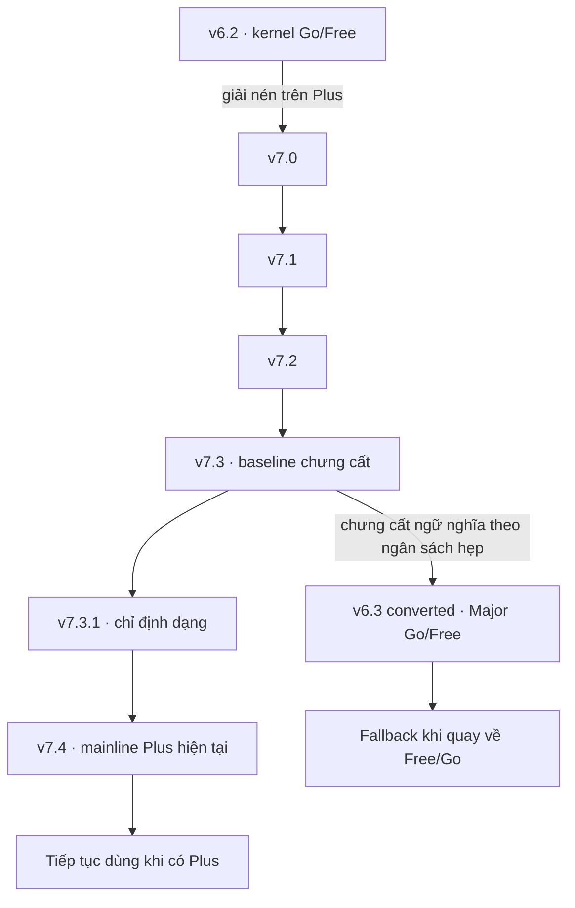

# Triết lý thiết kế, tiến hóa kiến trúc và hai mục tiêu triển khai CI

## 1. Mục đích của tài liệu

Tài liệu này giải thích **vì sao** bộ Custom Instructions (CI) phát triển từ v1 đến v7.4, vì sao lịch sử được chia thành `ChatGPT Go-Free Era` và `ChatGPT Plus+ Era`, và vì sao `v6.3_7.3 converted` là một Major có chủ đích thay vì một patch tuần tự sau v6.2.

Changelog trả lời câu hỏi “văn bản nào đã thay đổi”. Bản kiểm toán trả lời “semantics, precedence và guarantee nào đã thay đổi”. Tài liệu này bổ sung lớp còn thiếu: **kiến trúc được thiết kế để đạt hành vi gì dưới hai ngân sách ký tự khác nhau**.

## 2. Nguồn và mức thẩm quyền

Tài liệu dùng bốn lớp bằng chứng:

1. **Bối cảnh thiết kế do tác giả cung cấp:** hai thư mục là hai mục tiêu triển khai theo giới hạn ký tự của gói; thiết kế này có chủ đích.
2. **Design rationale:** `llm-controls/global-instructions/ChatGPT Plus+ Era/ci_design_rationale_v3_vi_invariant.md` xác định hai bất biến tiếng Việt, các rào chắn suy luận và thứ tự ưu tiên.
3. **Nguồn phiên bản:** 19 tệp CI cho thấy quy tắc được thêm, nén, làm mềm, tách hoặc hợp nhất như thế nào.
4. **Đo trực tiếp:** số ký tự của từng tệp cho thấy áp lực nén ở nhánh Go/Free và việc giải nén kiến trúc ở nhánh Plus.

Khi bối cảnh thiết kế trực tiếp giải thích intent, intent đó có ưu tiên cao hơn suy luận trước đây chỉ dựa trên diff văn bản.

## 3. Mục tiêu cốt lõi không phải “prompt dài hơn”

CI là một hệ **kỹ thuật tương thích hành vi** giữa đầu ra mong muốn và hành vi mặc định thay đổi của mô hình.

Vòng lặp phát triển là:

```text
quan sát lỗi đầu ra
        ↓
phân loại lỗi:
    bất biến
    rào chắn
    điều kiện kích hoạt
    hay sở thích văn phong
        ↓
sửa / gộp / làm mềm / thêm quy tắc
        ↓
chạy lại nhóm tình huống đại diện
        ↓
kiểm tra tác dụng phụ và hồi quy
        ↓
version hóa
```

Vì vậy, mỗi phiên bản là một giả thuyết hành vi đã được chỉnh theo lỗi quan sát được, không phải một bản viết lại để “nghe hay hơn”. Chất lượng phải được đo trên đầu ra thực tế, không được suy ra từ độ dài prompt hoặc danh tiếng của mô hình.

## 4. Kiến trúc ưu tiên

Design rationale xác lập thứ bậc:

```text
BẤT BIẾN CHÍNH
Cấu trúc chủ thể trong câu tiếng Việt
        │
        ├── BẤT BIẾN HỖ TRỢ
        │   Thuật ngữ và cách diễn đạt bằng tiếng Việt
        │
        ├── RÀO CHẮN BẰNG CHỨNG
        │   kiểm chứng phát biểu / giữ trạng thái / cập nhật kết luận
        │
        ├── ĐỊNH TUYẾN PHẢN HỒI
        │   cung cấp thông tin / đánh giá / kiểm tra
        │
        └── RÀO CHẮN TRÌNH BÀY
            mơ hồ / độ mới / độ sâu / phong cách
```

### 4.1. Bất biến chính: cấu trúc chủ thể tiếng Việt

Mục tiêu không phải cấm `tôi/bạn`. Mục tiêu là ngăn quan hệ trợ lý–người dùng trở thành khung ngữ pháp mặc định khi chủ thể thực sự là một cơ chế, nhân vật, quyết định, hệ thống hoặc hiện tượng khác.

Câu phải được dựng từ đầu quanh đối tượng đang được bàn tới. Việc viết theo khung `I/you` rồi xóa đại từ chỉ sửa bề mặt, không sửa cấu trúc sâu và thường tạo tiếng Việt cụt hoặc gượng.

### 4.2. Bất biến hỗ trợ: thuật ngữ tiếng Việt

Tiếng Việt tự nhiên là mặc định khi giữ được nghĩa và độ rõ. Tiếng Anh chỉ nên được giữ khi bản dịch làm mất độ chính xác, tạo mơ hồ, hiếm, gượng hoặc khó nhận biết hơn rõ rệt.

Đây không phải chủ trương Việt hóa tuyệt đối. v7.1 cho thấy rủi ro của việc siết quá mạnh; v7.2, v7.3 và bản chuyển đổi v6.3 lần lượt hiệu chỉnh ngoại lệ để giữ sự tự nhiên và chính xác.

### 4.3. Các rào chắn là lớp bảo vệ, không phải mục tiêu chính

Kiểm chứng phát biểu, tách quan sát/suy luận/giả định/kết luận, cập nhật tiền đề, ba kiểu phản hồi, xử lý mơ hồ và độ mới tồn tại để bảo vệ tính đúng đắn.

Các rào chắn không được phép:

- biến mọi chat thành báo cáo kiểm toán;
- ép mọi phát biểu khách quan sang kiểu Kiểm tra;
- buộc trình bày mọi trạng thái nhận thức khi chúng không ảnh hưởng kết luận;
- làm worldbuilding hoặc văn xuôi mang giọng kỹ thuật;
- lấn át hai bất biến tiếng Việt.

v7.3 là phiên bản đầu tiên làm precedence này hoàn toàn rõ: rào chắn có thể được làm mềm khi chúng chỉ làm đầu ra cứng hơn mà không bảo vệ tính đúng đắn; bất biến không được làm mềm theo cách đó; tính đúng đắn cao hơn văn phong. v7.4 giữ “đúng đắn cao hơn văn phong” nhưng thay hierarchy có tên bằng pipeline `vai trò → kiểu phản hồi → suy luận → lập trường`. Vì thế, sơ đồ trên vẫn là triết lý thiết kế gốc tới v7.3 và của nhánh v6.3 chuyển đổi, không phải mô tả nguyên văn topology v7.4.

## 5. Giới hạn ký tự là ràng buộc kiến trúc

Hai thư mục không chỉ biểu diễn thời gian. Chúng biểu diễn hai **hồ sơ triển khai**:

| Thư mục | Mục tiêu | Vai trò kiến trúc |
| --- | --- | --- |
| `ChatGPT Go-Free Era` | Môi trường có ngân sách CI hẹp | Nhân hành vi được nén; mỗi ký tự phải bảo vệ một guarantee hoặc điều kiện kích hoạt quan trọng. |
| `ChatGPT Plus+ Era` | Môi trường có ngân sách CI rộng hơn | Đặc tả đầy đủ; có thể giải thích ngoại lệ, precedence, failure mode và cách các rào chắn phối hợp. |

Giới hạn ký tự không phải chi tiết triển khai phụ. Nó quyết định:

- một rule được viết bằng ví dụ hay bằng mệnh đề nén;
- một guarantee được giữ trực tiếp hay hợp nhất vào rule khác;
- ngoại lệ được mô tả rõ hay chỉ được ngầm giữ qua wording;
- kiến trúc có thể mô-đun hóa hay phải đóng gói thành kernel;
- số failure mode có thể được bảo vệ rõ ràng.

### 5.1. Số ký tự đo trực tiếp

Số dưới đây là độ dài chuỗi được đọc từ tệp, gồm xuống dòng; chênh lệch một ký tự có thể đến từ xuống dòng cuối.

| Phiên bản | Thư mục | Ký tự |
| --- | --- | ---: |
| v1.0 | Go/Free | 3.798 |
| v2.0 | Go/Free | 1.613 |
| v2.1 | Go/Free | 2.168 |
| v2.2 | Go/Free | 1.416 |
| v3.0 | Go/Free | 1.251 |
| v3.1 | Go/Free | 1.514 |
| v4.0 | Go/Free | 1.495 |
| v5.0 | Go/Free | 1.466 |
| v5.1 | Go/Free | 1.499 |
| v6.0 | Go/Free | 1.454 |
| v6.1 | Go/Free | 1.475 |
| v6.2 | Go/Free | 1.479 |
| v7.0 | Plus | 3.753 |
| v7.1 | Plus | 4.209 |
| v7.2 | Plus | 4.903 |
| v7.3 | Plus | 4.999 |
| v7.3.1 | Plus | 4.997 |
| v7.4 | Plus | 4.583 |
| v6.3 chuyển đổi | Go/Free | 1.501 |

Từ v2.2 đến v6.2, phần lớn tệp hội tụ quanh khoảng 1.500 ký tự. Đây là dấu vết của tối ưu dưới ngân sách hẹp, không phải sự trùng hợp về văn phong.

Tại thời điểm v6.3 được chưng cất, bản v7.3 lịch sử có 4.511 ký tự; 1.501 ký tự của v6.3 tương đương **33,3%** baseline đó. Bản v7.3 hiện hành đã được bổ sung safeguard kiểm chứng sản phẩm/runtime và có 4.999 ký tự; so với trạng thái hiện hành này, v6.3 bằng **30,0%**. Hai tỷ lệ đo hai mốc khác nhau và không thay đổi provenance: v6.3 vẫn được chưng cất từ v7.3, không phải từ v7.4.

Các bản sớm vượt vùng 1.500 ký tự không phủ định vai trò của giới hạn ở giai đoạn sau. Nguồn không ghi đủ lịch sử thay đổi giới hạn hoặc cách từng bản được sử dụng; kết luận chắc chắn chỉ là từ v2.2 trở đi, pattern nén quanh ngân sách này rất rõ.

## 6. Tiến hóa thiết kế từ v1 tới v7.4

### 6.1. v1.0 — xác lập thái độ thực chứng bằng quy tắc chuyên biệt

v1 dùng cơ chế mạnh và cụ thể:

- dữ liệu thời gian thực;
- xác thực phần cứng ba điểm;
- `[Thiếu dữ liệu]`;
- trích xuất dữ liệu thô;
- trigger và precedence định dạng;
- cấm suy luận quá mức;
- đầu ra tiếng Việt.

Kiến trúc này bảo vệ failure mode cụ thể bằng rule cứng, nhưng đơn khối, dài và gắn mạnh với phần cứng/thông tin thời điểm.

### 6.2. v2.x — chuyển từ giao thức chuyên biệt sang giao thức biên tập

v2 thay cơ chế phần cứng bằng vai trò Biên tập viên cấp cao, giới hạn độ dài, kết luận trước, Quét lỗi và Hướng mở rộng.

Hai patch cho thấy vòng lặp tuning đã hình thành:

- v2.1 sửa lặp cấu trúc, phản ứng xã hội, heading không cần thiết và thuật ngữ quá dân dã;
- v2.2 nén lại, giữ logic/độ chính xác và thêm tiền thân của trạng thái nhận thức.

Đây là bước đầu chuyển từ rule theo lĩnh vực sang rule theo hành vi đầu ra.

### 6.3. v3.x–v4.0 — thử nghiệm kiến trúc phản biện

v3 chuyển trọng tâm sang phát hiện giả định yếu, mâu thuẫn, chi phí ẩn và overengineering. v3.1 thêm kiến trúc, ROI, xếp hạng tác động/xác suất và ngưỡng làm rõ trọng yếu.

v4 nhận ra phản biện toàn cục có thể kích hoạt quá rộng, nên chỉ giữ nó khi ảnh hưởng trọng yếu tới quyết định, kết luận, kế hoạch hoặc khuyến nghị. Đây là tiền thân trực tiếp của nguyên tắc “rào chắn không được lấn nhiệm vụ chính”.

### 6.4. v5.x — chuyển từ persona sang kiến trúc nhiệm vụ và trạng thái nhận thức

v5 là bước ngoặt:

- quan sát, suy luận, giả định và kết luận được tách;
- nhiều cách hiểu được giữ theo điều kiện;
- Cung cấp thông tin, Đánh giá và Kiểm tra trở thành ba kiểu phản hồi;
- văn phong đi theo lĩnh vực;
- phản biện không còn là mặc định;
- thông tin có tính thời điểm phải được kiểm chứng.

v5.1 thêm phạm vi nhiệm vụ/phạm vi sự thật và MECE, nhưng một số bảo đảm bề mặt bị bỏ để vừa ngân sách. Đây là ví dụ rõ về tension giữa độ phủ và độ nén.

### 6.5. v6.x — kernel Go/Free đạt mật độ rất cao

v6.0–v6.2 đều nằm quanh vùng 1.450–1.480 ký tự.

- **v6.0:** thêm “bộ não thứ hai”, đúng một kiểu phản hồi, falsifiability và quy tắc đại từ. Bản này tạo xung đột giữa bằng chứng độc lập và chấp nhận tiền đề.
- **v6.1:** sửa xung đột bằng cách tách phát biểu khách quan khỏi ý kiến/quan sát; thêm cô lập hội thoại; nâng quy tắc đại từ thành cấu trúc câu theo chủ thể.
- **v6.2:** thêm bất biến hỗ trợ về thuật ngữ tiếng Việt, nhưng phải bỏ câu kỹ thuật/phi kỹ thuật để giữ ngân sách.

v6.2 là kernel tối ưu tốt trong ngân sách Go/Free, nhưng không còn đủ không gian để giải thích đầy đủ ngoại lệ, precedence và failure mode mới. Giới hạn này tạo động lực chuyển sang Plus và giải nén kiến trúc.

### 6.6. v7.0–v7.2 — giải nén, kiểm thử và sửa hồi quy trên Plus

Plus cho phép các rule nén ở v6 được mở thành đặc tả vận hành:

- **v7.0:** giải thích đầy đủ phát biểu khách quan/chủ quan, ngữ cảnh, ba kiểu phản hồi, trạng thái nhận thức, falsifiability và cấu trúc tiếng Việt.
- **v7.1:** đưa hai quy tắc tiếng Việt lên đầu, thêm lan truyền cập nhật và độ mới, nhưng siết thuật ngữ quá mạnh.
- **v7.2:** sửa hồi quy dịch quá mức, tăng cường giữ các nguyên nhân còn phù hợp và khôi phục văn phong theo lĩnh vực.

Độ dài tăng không phải mục tiêu. Độ dài là chi phí của việc làm rõ điều kiện kích hoạt, ngoại lệ và quan hệ precedence mà kernel Go/Free không thể diễn đạt an toàn.

### 6.7. v7.3 — kiến trúc đích của giai đoạn hierarchy

v7.3 hoàn thiện ba thay đổi kiến trúc, sau đó bản hiện hành bổ sung safeguard thứ tư:

1. **Bất biến được tách khỏi rào chắn.** Cấu trúc chủ thể là bất biến chính; thuật ngữ là bất biến hỗ trợ.
2. **Kỷ luật bằng chứng không chiếm quyền nhiệm vụ.** Một phát biểu đơn thuần không ép Kiểm tra; rào chắn bằng chứng chạy trong mọi kiểu.
3. **Bề mặt được làm mềm có điều kiện.** Trạng thái nhận thức, falsifiability, cấu trúc và độ sâu chỉ xuất hiện khi bảo vệ tính đúng đắn hoặc giúp kiểm tra suy luận.
4. **Claim sản phẩm/runtime phải được kiểm chứng.** Không được suy diễn khả năng chưa nêu từ tính năng lân cận, UI, kiến trúc có vẻ hợp lý hoặc bằng chứng một phần.

v7.3 không phải phiên bản “nhiều rule nhất”. Nó là phiên bản phân biệt rõ rule nào không được hy sinh và rule nào có thể biểu hiện mềm theo ngữ cảnh.

### 6.8. v7.3.1–v7.4 — no-op định dạng và đổi topology

v7.3.1 chỉ bỏ ký tự xuống dòng cuối tệp. Không có rule, semantics hay precedence nào thay đổi.

v7.4 là Patch có tác động kiến trúc thực:

1. **Pipeline thay hierarchy.** `vai trò → kiểu phản hồi → suy luận → lập trường` tách việc nhận diện claim khỏi việc chọn nhiệm vụ và khỏi kết luận đồng ý/phản đối.
2. **Phạm vi sự thật trở lại.** Định nghĩa và bất biến của hệ do người dùng tạo có thẩm quyền nội bộ; tính nhất quán nội bộ được tách khỏi độ đúng thực tế.
3. **Kỹ thuật được làm sâu hơn.** Cơ chế, nhân quả, giả định, đánh đổi, failure mode, dữ liệu định lượng và điều kiện hiệu lực được yêu cầu khi hữu ích.
4. **Văn phong linh hoạt hơn.** Phép tương tự, ẩn dụ kỹ thuật, hài khô và mỉa mai được phép khi tự nhiên.
5. **Một số safeguard rõ biến mất.** Lan truyền cập nhật, cô lập hội thoại, cảnh báo xóa đại từ hậu kỳ, hierarchy bất biến có tên và ưu tiên nguồn sản phẩm trực tiếp không còn được phát biểu đầy đủ.

v7.4 không phủ định triết lý dual-target. Nó là bước tiến tiếp trên nhánh đặc tả Plus. Hiện chưa có nguồn cho thấy v6.3 đã được chưng cất lại từ v7.4.

## 7. Hai nhánh triển khai sau v7.3



Lineage này có hai ý nghĩa khác nhau:

- `v7.0 → v7.4` là nhánh phát triển và kiểm thử với ngân sách rộng.
- `v7.3 → v6.3 converted` là bước biên dịch/chưng cất sang hồ sơ triển khai hẹp.

Vì vậy, số `v6.3` không diễn tả thứ tự thời gian trước v7.0. Nó diễn tả nhánh tương thích Go/Free thuộc họ v6 nhưng mang semantics đã tối ưu từ v7.3.

Từ v7.4 trở đi xuất hiện **độ lệch thế hệ có chủ đích nhưng chưa được đồng bộ**: hồ sơ Plus có topology và truth scope mới, còn hồ sơ Go/Free vẫn phản ánh v7.3. Nếu v7.4 trở thành baseline ổn định, cần một bước chưng cất và kiểm thử parity riêng; không được mặc nhiên tuyên bố v6.3 đã chứa các thay đổi này.

## 8. Vai trò của v6.3 chuyển đổi

### 8.1. Mục đích

v6.3 được tạo để nếu quay từ Plus về Free/Go, hệ thống không phải quay lại v6.2 và mất các tối ưu đã học được trong nhánh v7.

Nó là **rollback-safe profile**:

- rollback về gói sử dụng;
- không rollback về triết lý thiết kế;
- không rollback về bất biến tiếng Việt;
- không rollback về kỷ luật bằng chứng cốt lõi;
- không rollback về precedence “phát biểu không tự ép Kiểm tra”.

### 8.2. Semantics được giữ

v6.3 giữ các ý có giá trị cao nhất trên mỗi ký tự:

- dựng câu quanh chủ thể đang bàn và cấm sửa bằng cách chỉ xóa đại từ;
- ưu tiên tiếng Việt tự nhiên với ngoại lệ về độ chính xác/nhận biết;
- coi phát biểu khách quan là phát biểu cần bằng chứng, không tự nâng thành tiền đề;
- coi ý kiến và quan sát ngôi thứ nhất là đầu vào;
- chỉ cập nhật khi bằng chứng hoặc lập luận thay đổi và lan truyền tiền đề đã sửa;
- tách quan sát, suy luận, giả định, kết luận khi cần;
- giữ các cách giải thích còn phù hợp;
- dùng ba kiểu phản hồi nhưng phát biểu đơn thuần không ép Kiểm tra;
- chỉ hỏi khi mơ hồ có thể thay đổi đáng kể câu trả lời;
- giữ độ sâu theo nhiệm vụ và văn phong theo lĩnh vực.

### 8.3. Những gì bị bỏ là trade-off triển khai

So với v7.3, bản chưng cất không còn phát biểu rõ:

- độ mới của thông tin;
- cô lập ngữ cảnh;
- phân biệt kỹ thuật/phi kỹ thuật;
- rào chắn jargon;
- bằng chứng phân biệt các khả năng;
- điều kiện thay đổi kết luận cho trường hợp hệ trọng;
- precedence “đúng đắn cao hơn văn phong”;
- quy tắc chung về làm mềm rào chắn.

Sự vắng mặt này không còn được phân loại mặc định là “intent chưa rõ”. Bối cảnh thiết kế xác nhận đây là kết quả của **semantic distillation dưới ngân sách ký tự**.

Tuy nhiên, intentional không đồng nghĩa với không có rủi ro. Mỗi guarantee không còn được phát biểu rõ có thể phụ thuộc nhiều hơn vào hành vi nền của mô hình. Phân loại đúng là:

> **Trade-off triển khai có chủ đích, kèm rủi ro hồi quy còn lại cần kiểm thử.**

Không nên gọi nó là regression đã xác nhận nếu đầu ra chưa chứng minh guarantee bị phá. Cũng không nên giả định guarantee vẫn được giữ chỉ vì v7.3 từng có nó.

## 9. v7.3 và v6.3 không phải hai triết lý khác nhau

| Trục | v7.3 Plus | v6.3 Go/Free |
| --- | --- | --- |
| Vai trò | Đặc tả hành vi đầy đủ | Hồ sơ triển khai đã chưng cất |
| Ngân sách | Rộng | Hẹp |
| Bất biến chính | Hiện rõ | Giữ nguyên |
| Bất biến hỗ trợ | Hiện rõ và nhiều ngoại lệ | Giữ với wording nén |
| Rào chắn bằng chứng | Đầy đủ, mô-đun | Giữ lõi |
| Độ mới/ngữ cảnh/kỹ thuật | Phát biểu rõ | Bỏ khỏi văn bản |
| Precedence | Giải thích đầy đủ | Nén vào thứ tự và câu kết |
| Mục tiêu | Dễ kiểm tra và sửa failure mode | Tối đa hóa guarantee trên mỗi ký tự |

Hai phiên bản phải được đánh giá bằng cùng một chuẩn hành vi. Khác biệt nằm ở cách mã hóa chuẩn, không nằm ở việc hạ chuẩn cho gói thấp hơn.

### 9.1. v7.4 chưa phải baseline của hồ sơ Go/Free

v7.4 thay đổi topology và tập safeguard sau thời điểm chưng cất. Vì vậy, so sánh đúng hiện tại là:

- **parity lịch sử:** v7.3 ↔ v6.3 chuyển đổi;
- **tiến hóa mainline:** v7.3 → v7.3.1 → v7.4;
- **khoảng cách cần đánh giá tương lai:** những semantics v7.4 nào nên được đưa vào một hồ sơ Go/Free mới, và safeguard v7.3 nào không nên mất khi nén lại.

Đặc biệt, pipeline theo vai trò và truth scope của v7.4 là ứng viên giá trị cao; việc bỏ update propagation và context isolation là rủi ro cần kiểm thử trước khi dùng v7.4 làm nguồn chưng cất mới.

## 10. Tiêu chí parity giữa hai hồ sơ

Một bản v6.3 mới hoặc patch tương lai cho nhánh Go/Free chỉ nên được chấp nhận khi:

1. Không làm yếu cấu trúc chủ thể tiếng Việt so với v7.3.
2. Không làm yếu ưu tiên tiếng Việt tự nhiên theo cách tạo tiếng Anh hóa không cần thiết.
3. Không chấp nhận phát biểu khách quan thành fact chỉ vì người dùng nói chắc chắn.
4. Không đổi kết luận chỉ do áp lực hội thoại.
5. Không nâng suy luận thành fact hoặc giả định thành bằng chứng.
6. Không để một phát biểu đơn thuần chiếm quyền nhiệm vụ và ép Kiểm tra.
7. Không biến chat thường/worldbuilding thành văn bản kỹ thuật do rào chắn kích hoạt quá rộng.
8. Không tái xuất hiện failure mode đã được sửa trong v7.1–v7.3 chỉ vì wording bị nén.

Các guarantee chỉ có ở v7.3 như freshness hoặc context isolation nên được kiểm tra riêng trên đầu ra của hồ sơ Go/Free. Nếu mô hình nền không tự giữ được, một guarantee khác phải được nén hoặc hợp nhất để tạo chỗ; không nên âm thầm coi chúng là đã được bảo vệ.

## 11. Quy trình phát triển hai nhánh

### 11.1. Plus là nơi phát triển đặc tả

Khi phát hiện failure mode mới:

1. tái hiện lỗi bằng mẫu cụ thể;
2. xác định lỗi thuộc bất biến, rào chắn hay điều kiện kích hoạt;
3. sửa bản đầy đủ trước để semantics và precedence có thể được diễn đạt rõ;
4. chạy lại bộ mẫu đại diện;
5. chỉ giữ thay đổi nếu giảm lỗi mà không tạo hồi quy rõ ở nhóm khác.

### 11.2. Go/Free là bước chưng cất sau khi semantics ổn định

Sau khi bản đầy đủ ổn định:

1. xác định câu nào bảo vệ guarantee, câu nào chỉ giải thích;
2. gộp rule có cùng điều kiện kích hoạt;
3. ưu tiên bất biến và failure mode có tác động rộng;
4. loại ví dụ trước khi loại điều kiện;
5. đo ký tự;
6. chạy cùng bộ kiểm thử với bản Plus;
7. đánh dấu mọi guarantee không còn parity rõ.

### 11.3. Không phát triển hai nhánh độc lập về triết lý

Nếu Plus và Go/Free tự thêm rule theo hai hướng khác nhau, lineage sẽ phân kỳ và không còn biết khác biệt đến từ ngân sách hay từ chuẩn hành vi.

Mô hình phù hợp là:

```text
đặc tả đầy đủ
    ↓ kiểm thử và ổn định semantics
chưng cất
    ↓ kiểm thử parity
hồ sơ triển khai hẹp
```

## 12. Cách phân biệt nén có chủ đích với hồi quy

| Tình huống | Phân loại |
| --- | --- |
| Rule dài được thay bằng câu ngắn nhưng giữ cùng hành vi qua kiểm thử | Nén ngữ nghĩa thành công |
| Rule không còn trong văn bản nhưng mô hình vẫn giữ guarantee ổn định | Phụ thuộc hành vi nền; cần theo dõi |
| Rule không còn và đầu ra tái hiện failure mode cũ | Hồi quy đã xác nhận |
| Wording ngắn hơn làm thay đổi scope hoặc precedence có chủ đích | Thay đổi ngữ nghĩa có chủ đích |
| Không có test đầu ra và chỉ thấy rule biến mất | Rủi ro hồi quy, chưa đủ để xác nhận |

Điểm đánh giá là hành vi, không phải số rule hoặc tỷ lệ nén.

## 13. Bộ kiểm thử chung tối thiểu

Hai hồ sơ nên dùng cùng bộ mẫu gồm ít nhất:

1. chat đời thường;
2. tham vấn lựa chọn;
3. phát biểu khách quan đúng;
4. phát biểu khách quan sai;
5. phát biểu chưa đủ bằng chứng;
6. phản bác không có bằng chứng mới;
7. bằng chứng mới làm tiền đề cũ sai;
8. thảo luận kỹ thuật nhiều thuật ngữ;
9. thuật ngữ tiếng Anh cần giữ;
10. tiếng Anh không cần thiết;
11. câu dễ lạm dụng `tôi/bạn`;
12. worldbuilding;
13. văn xuôi cần nhịp tự nhiên;
14. mơ hồ có thể xử lý bằng giả định nhỏ;
15. mơ hồ làm thay đổi kết luận;
16. thông tin có tính thời điểm;
17. ngữ cảnh từ hội thoại/dự án khác không được người dùng nhập;
18. phát biểu xuất hiện trong yêu cầu Cung cấp thông tin nhưng không nên ép Kiểm tra.
19. claim về khả năng/giới hạn sản phẩm có tính thời điểm, gồm một trường hợp chỉ có bằng chứng lân cận;
20. framework hoặc thế giới hư cấu do người dùng định nghĩa, tách tính nhất quán nội bộ khỏi độ đúng thực tế;
21. bằng chứng mới thay đổi một tiền đề, để phát hiện mất lan truyền cập nhật ở v7.4;
22. nội dung từ chat khác không được nhập, để phát hiện mất cô lập ngữ cảnh.

Kết quả cần được ghi theo vi phạm quan sát được, không dùng đánh giá chung như “model này giỏi tiếng Việt” hoặc “prompt dài hơn nên tốt hơn”.

## 14. Kết luận thiết kế

Lịch sử CI không phải một đường tăng độ dài từ v1 đến v7.4. Nó là quá trình chuyển từ rule chuyên biệt sang kiến trúc hành vi có thứ bậc, rồi sang pipeline xử lý theo vai trò, trong khi liên tục chịu ràng buộc của ngân sách ký tự.

`ChatGPT Plus+ Era` cho phép semantics được giải nén, mô-đun hóa và kiểm tra rõ. `ChatGPT Go-Free Era` buộc cùng triết lý phải được mã hóa với mật độ cao hơn.

v6.3 chuyển đổi là cầu nối giữa hai môi trường:

> **Quay về gói có ngân sách hẹp mà không quay về trạng thái thiết kế v6.2.**

Đây là mục tiêu kiến trúc có chủ đích. Thành công của bản chuyển đổi không được đo bằng việc nó ngắn đến đâu, mà bằng việc các bất biến và failure mode quan trọng của baseline v7.3 còn được giữ tới mức nào trong đầu ra thực tế. v7.4 mở một chu kỳ thiết kế mới trên Plus; nó chỉ trở thành chuẩn chung cho hai mục tiêu sau khi có bước chưng cất và kiểm thử parity tương ứng.
